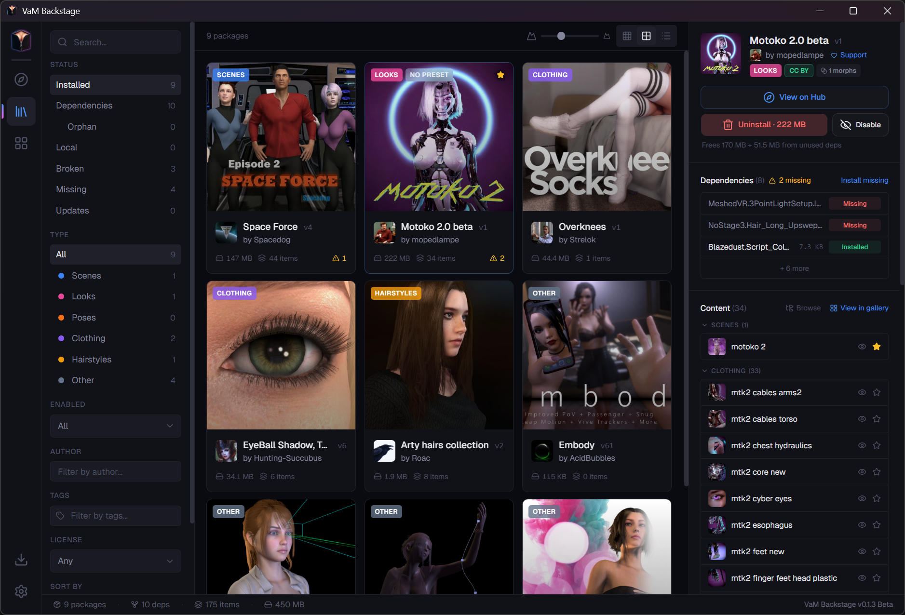

# VaM Backstage [](https://github.com/cyberpunk2073/vam-backstage/actions/workflows/ci.yml)

A desktop app for managing [Virt-a-Mate](https://www.virtamate.com/) `.var` packages. Scans your library, builds a dependency graph, and separates content you actually installed from content that's only there because something depends on it; it then hides the clutter from VaM's content browser automatically. Browse your library contents, search and install from the VaM Hub with full dependency resolution.



[](https://github.com/cyberpunk2073/vam-backstage/releases/latest/download/vam-backstage-setup.exe) [](https://github.com/cyberpunk2073/vam-backstage/releases/latest)

## Why

VaM treats every `.var` in `AddonPackages/` equally. Install a scene that pulls in 40 dependency packages and suddenly your scenes, looks, and clothing lists are full of stuff you never asked for. There's no built-in way to tell what's a dependency and what's yours, and no tooling to manage any of it.

## Features

**Hide dependency clutter.** Dependency scenes, looks, poses, clothing, and hairstyles are automatically hidden from VaM's content browser. Nothing is modified or deleted; toggle hidden/favorite per-package or per-item at any time.

**Dependency graph.** Full dependency tree for every package: what it needs, what depends on it, what's missing and broken. Uninstalling a package identifies orphaned dependencies and offers to clean them up. Reclassify any package as yours or a dependency and visibility rules follow automatically.

**Hub integration.** Search and install packages from the VaM Hub without leaving the app. Type, pricing, author, tag, and license filters. Embedded Hub page preview. Installing a package resolves all missing dependencies and downloads everything concurrently with live progress. Check for available updates to installed packages.

**Content browser.** Browse every scene, look, pose, clothing item, and hairstyle across all your packages. Filter by type, toggle hidden/favorite, cross-navigate to the owning package or its Hub page.

**Library browser.** Gallery and table views for installed packages. Filter by status (yours, dependency, missing deps, orphans, disabled), content type, author, and tags. Package detail panels show contents, the full dep tree, and actions like uninstall, disable, and force-remove.

Picks up external file changes in real time, auto-detects the VaM directory on first launch.

## Development

Requires Node.js >= 24.

```bash
npm install
npm run dev
```

Build for your platform:

```bash
npm run build:win
npm run build:mac
npm run build:linux
```

For a detailed project overview, architecture, and implementation notes, see [docs/Implementation.md](docs/Implementation.md).
