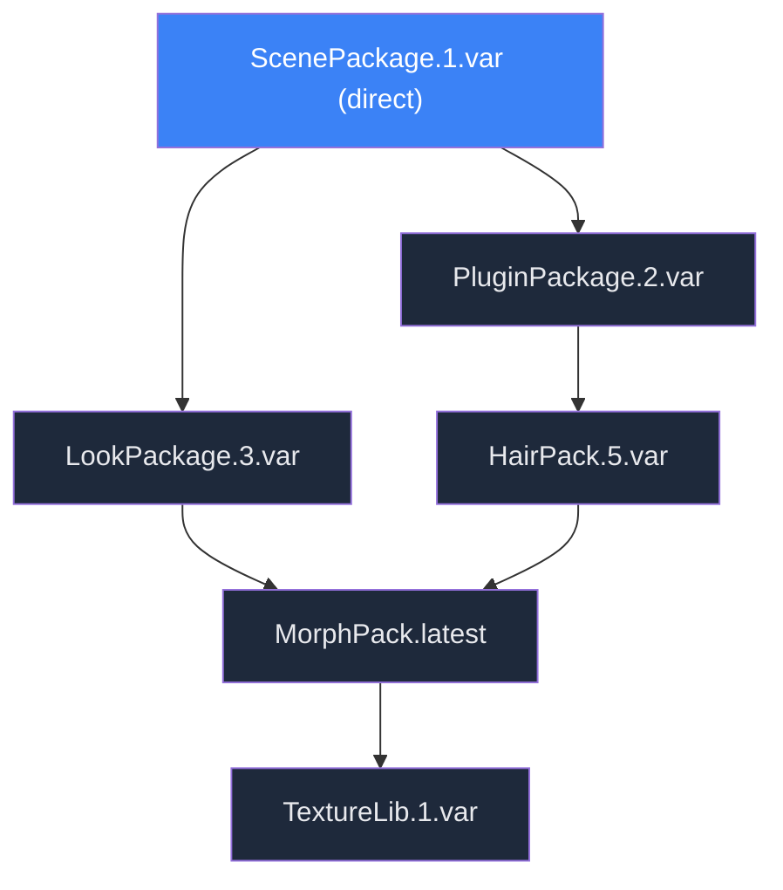
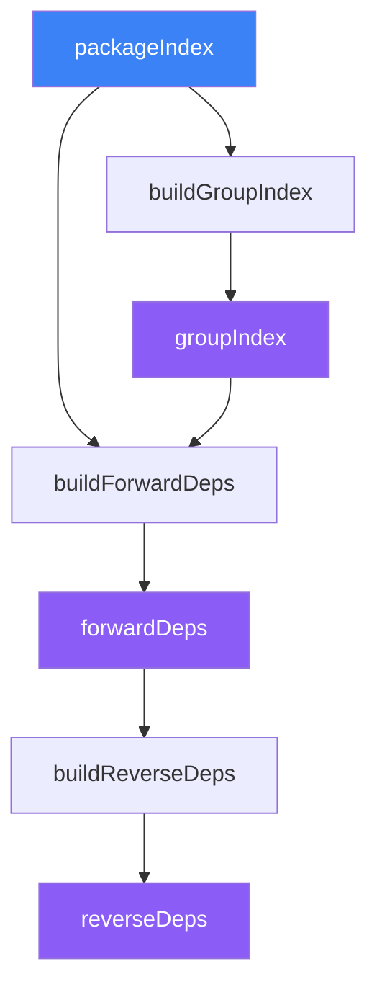
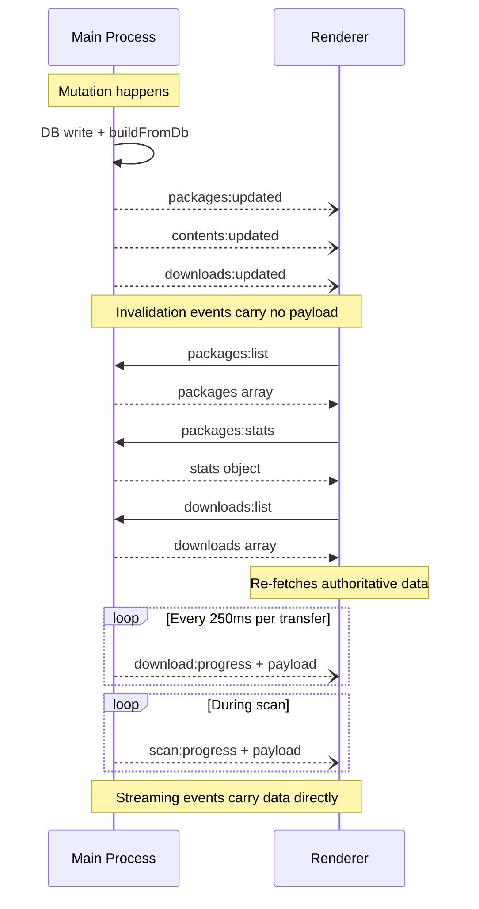
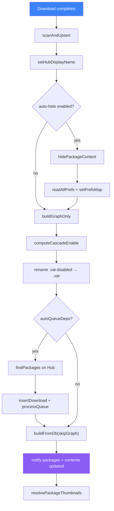

# VaM Backstage — Implementation Documentation

## 1. What Was Built

VaM Backstage is a desktop application for managing Virt-a-Mate (VaM) `.var` packages. VaM uses ZIP-based packages containing scenes, looks, plugins, morphs, and other content. These packages form dependency trees, but VaM itself does not distinguish between packages the user chose to install and packages that exist only because something depends on them. This leads to a cluttered content browser where dependency content (morphs, plugins, clothing, etc.) pollutes the user's view.

VaM Backstage solves this by:

- **Differentiating direct installs from dependencies.** On first scan, a graph-based leaf-detection algorithm classifies packages. Users can promote/demote packages manually afterward.
- **Auto-hiding dependency content in VaM's content browser.** The app manages `.hide`/`.fav` sidecar files that VaM reads natively, making dependency content invisible in VaM without modifying any package files.
- **Providing a full package browser with Hub integration.** Users can search, browse, and install packages from the VaM Hub, with dependency resolution and concurrent downloads.
- **Content inspector.** A flat gallery of all content items across all packages with visibility/favorite controls.
- **Package removal with dependency cascade.** Uninstalling a package identifies orphan dependencies and optionally removes them.

The application is built with Electron 39, React 19, SQLite (better-sqlite3), Zustand for state management, and Tailwind CSS v4 with shadcn/ui components. It is JavaScript-only (no TypeScript). The UI is dark-only.

---

## 2. User Experience

### First Launch

1. The app auto-detects the VaM directory by searching upward from its own location (up to 5 levels), looking for an `AddonPackages` directory containing `.var` files.
2. A first-run wizard opens:
   - **Welcome step**: Shows detected VaM directory, `.var` file count, "Scan library" CTA, option to change directory.
   - **Scanning step**: Animated progress through 6 phases — indexing files, reading manifests, building dependency graph, analyzing content, detecting leaves, finalizing database.
   - **Setup step** (if packages found): "Found X packages — Y direct, Z dependencies." Choice: "Hide dependency content" (recommended) vs "Keep everything visible."
   - **Done step**: Stats summary, "Open VaM Backstage."
3. If no packages on disk, the setup step is skipped; auto-hide is enabled by default.

### Steady-State Usage

- **Hub**: Browse VaM Hub packages with full-text search, type/pricing/author/tag/license filters, and sort options. Click a card to see a detail panel (left) with an embedded webview showing the actual Hub page (right). Install triggers download of the package plus all missing dependencies.
- **Library**: Browse installed packages as a gallery (compact/detailed cards) or table. Select a package to see a detail panel with content list, dependency tree, dependents, and actions (uninstall/promote/demote/disable/force-remove). Missing dependencies section shows broken packages with install actions.
- **Content**: Browse all content items flat across packages as a gallery or table. Select an item to see the owning package, toggle hidden/favorite. Cross-navigate to Library or Hub.
- **Downloads**: Slide-in panel (between ribbon and content area) showing active/queued/completed/failed downloads with live progress, speed, and ETA. Pause/resume all, cancel, retry.
- **Settings**: VaM directory configuration, library rescanning, integrity verification, auto-hide toggle, thumbnail blur (privacy), developer options.
- **Status bar**: Always-visible bottom strip with package count, dependency count, content items, total size, active download progress, scan progress, and app version.

### Cross-Navigation

- Hub card → "View in Library" → Library view with that package selected
- Library detail → compass icon → Hub view with that package's detail
- Library content section → "View in gallery" → Content view filtered by that package
- Content detail → "Library" / "Hub" buttons → jump to respective view

---

## 3. Architecture

```
┌───────────────────────────────────────────────────────────┐
│                    Renderer Process                       │
│                                                           │
│  App.jsx (shell, ribbon, view switching)                  │
│  ├── HubView / LibraryView / ContentView / SettingsView   │
│  ├── DownloadsPanel                                       │
│  ├── FirstRun Wizard                                      │
│  ├── StatusBar                                            │
│  └── Zustand Stores (hub, library, content, downloads,    │
│       installed, status)                                  │
│                                                           │
│  ──── contextBridge (preload/index.js) ────               │
├───────────────────────────────────────────────────────────┤
│                       Main Process                        │
│                                                           │
│  index.js ── startup orchestration                        │
│  ├── db.js ── SQLite persistence layer                    │
│  ├── store.js ── in-memory indexes & computed state       │
│  ├── scanner/ ── .var reading, classification, graph      │
│  ├── hub/ ── Hub API client + CDN index                   │
│  ├── downloads/ ── concurrent download engine             │
│  ├── vam-prefs.js ── .hide/.fav sidecar management        │
│  ├── watcher.js ── FS monitoring (chokidar + fs.watch)    │
│  ├── thumb-resolver.js ── Hub thumbnail fetching          │
│  ├── avatar-cache.js ── Hub author avatar caching         │
│  └── ipc/ ── handler modules per domain                   │
└───────────────────────────────────────────────────────────┘
```

### Data Flow

On startup, the main process reads the SQLite database and filesystem, then builds in-memory structures (package index, dependency graph, content list, prefs map). IPC handlers serve data from these in-memory structures, not from SQL queries. The database is written to for persistence only (scan cache, settings, downloads).

On changes (FS watcher events, user actions, download completions), the main process updates the database, rebuilds affected in-memory structures, and pushes invalidation events (`packages:updated`, `contents:updated`) to the renderer. The renderer re-fetches from the IPC bridge and re-renders.

### IPC Contract

- **Request-response**: `ipcMain.handle` / `ipcRenderer.invoke` — the renderer calls named channels and awaits results.
- **Events**: `webContents.send` / `ipcRenderer.on` — the main process pushes notifications (download progress, invalidation signals, scan progress).

All IPC channels are wrapped by the preload script into a typed `window.api` object.

---

## 4. Component Tree

```
App.jsx
├── Ribbon (56px left nav, fixed)
│   ├── NavButton: Hub (Compass icon)
│   ├── NavButton: Library (Library icon)
│   ├── NavButton: Content (LayoutGrid icon)
│   ├── NavButton: Downloads (Download icon, badge: active+queued count, error count)
│   └── NavButton: Settings (Settings icon)
├── DownloadsPanel (340px slide-in, between ribbon and content)
│   ├── Section: In-flight (active + queued, sorted: direct first)
│   │   └── DownloadRow × N (progress bar, speed, ETA, pause/cancel)
│   ├── Section: Completed (most recent first, max 5 + expand)
│   └── Section: Failed (retry/remove individual, retry all)
├── Main Content Area (flex-1)
│   ├── HubView
│   │   ├── FilterPanel (resizable left)
│   │   ├── Toolbar (count + card size toggle)
│   │   ├── HubCard gallery (infinite scroll, 250px cards, minimal/medium modes)
│   │   └── HubDetail (replaces gallery on card click)
│   │       ├── BackBar (breadcrumb)
│   │       ├── PackageInfoPanel (320px left, scrollable)
│   │       │   ├── Hero image, name, author card, badges
│   │       │   ├── Stats, dates, description
│   │       │   ├── Action button (Install/Installed/Add to Library)
│   │       │   └── DepTree (expandable, DepRow × N with status tags)
│   │       └── EmbeddedBrowser (flex-1, Electron <webview>)
│   │           ├── BrowserToolbar (back/forward/reload + URL bar)
│   │           └── TabBar (Overview/Reviews/History/Discussion)
│   ├── LibraryView
│   │   ├── FilterPanel (resizable left)
│   │   ├── Toolbar (count + Install All Missing + view toggle)
│   │   ├── VirtualGrid / Table (LibraryCard or LibraryTableRow × N)
│   │   └── LibraryDetailPanel (resizable right, 260–500px)
│   │       ├── Header (thumb, name, version, author, badges, Hub link)
│   │       ├── Actions (uninstall/promote/force-remove/disable, contextual)
│   │       ├── Description
│   │       ├── Dependencies (DepRow × N, "Install missing" action)
│   │       ├── Dependents (expandable list)
│   │       └── ContentCategory groups (collapsible, Eye/Star toggles per item)
│   ├── ContentView
│   │   ├── FilterPanel (resizable left)
│   │   ├── Toolbar (count + view toggle + thumbnail size slider)
│   │   ├── VirtualGrid / Table (ContentCard × N, variable size)
│   │   └── ContentDetailPanel (resizable right, 220–450px)
│   │       ├── ItemHeader (thumb, name, type badge, custom tag, Eye/Star)
│   │       ├── PackageInfo (thumb, name, author, version, badges)
│   │       ├── CrossNav (Library + Hub buttons)
│   │       └── MoreFromPackage (grouped by type, clickable items)
│   └── SettingsView
│       ├── VaM Directory (path + browse)
│       ├── Library Management (stats, rescan, integrity check)
│       ├── Content Visibility (auto-hide toggle)
│       ├── Privacy (thumbnail blur toggle)
│       └── Developer (Hub debug logging, nuke database)
├── FirstRunWizard (modal overlay, 480px card)
│   ├── WelcomeStep (directory picker, file count)
│   ├── ScanningStep (progress bar, 6 animated phases)
│   ├── SetupStep (hide deps choice)
│   └── DoneStep (stats, open button)
├── StatusBar (28px bottom)
│   ├── Counts (packages, deps, items, size — with tooltips)
│   ├── Download/Scan progress (bar + info, only when active)
│   └── Version label
├── ToastContainer (bottom-right, animated notifications)
├── ErrorBoundary (catches render errors with retry)
└── Action Dialogs (AlertDialog-based confirmation modals)
```

---

## 5. Design System

### Color Palette (Dark-Only)

| Token            | Hex       | Usage                    |
| ---------------- | --------- | ------------------------ |
| `base`           | `#0a0b10` | App background           |
| `surface`        | `#111218` | Card/panel backgrounds   |
| `elevated`       | `#191a22` | Raised surfaces          |
| `hover`          | `#1f2029` | Hover states, borders    |
| `active`         | `#272833` | Active/pressed states    |
| `border-bright`  | `#2e303b` | Prominent borders        |
| `text-primary`   | `#e8e9ed` | Primary text             |
| `text-secondary` | `#82849a` | Secondary text           |
| `text-tertiary`  | `#4e5064` | Muted text, placeholders |
| `accent-blue`    | `#4a91f1` | Primary accent           |
| `accent-pink`    | `#ef5bed` | Secondary accent         |
| `accent-purple`  | `#8b5cf6` | Tertiary accent          |
| `success`        | `#34d399` | Positive states          |
| `warning`        | `#fbbf24` | Warning states           |
| `error`          | `#f87171` | Error states             |

Colors are defined as CSS custom properties in `main.css` via `@theme` and consumed through Tailwind utilities (`bg-base`, `text-text-secondary`, `border-accent-blue`, etc.).

### Content Type Colors

| Type       | Color              |
| ---------- | ------------------ |
| Scenes     | `#3b82f6` (blue)   |
| Looks      | `#ec4899` (pink)   |
| Clothing   | `#8b5cf6` (purple) |
| Hairstyles | `#f59e0b` (amber)  |
| Poses      | `#f97316` (orange) |
| SubScenes  | `#06b6d4` (cyan)   |

An `Other` category covers non-core package types with a neutral gray.

### Typography

- Font: Geist Variable (system sans-serif fallback)
- No user-select by default (app chrome feel)

### Custom CSS Utilities

| Class              | Description                                            |
| ------------------ | ------------------------------------------------------ |
| `.gradient-text`   | Blue-to-pink text gradient via `background-clip: text` |
| `.gradient-border` | Blue-to-pink border using mask-composite trick         |
| `.btn-gradient`    | Gradient button (blue-to-purple) with lift on hover    |
| `.card-glow`       | Blue-tinted box-shadow on hover                        |
| `.skeleton`        | Shimmer loading animation                              |
| `.progress-bar`    | Animated gradient background for download bars         |
| `.spin-slow`       | Slow CSS rotation                                      |

### Procedural Gradients

Three deterministic gradient functions generate unique visual identities from string inputs:

- **`getGradient(id)`**: For packages — produces a 3-layer gradient (2 radial + 1 linear) from a numeric hash of the package ID. Each layer has a random hue, saturation, and position.
- **`getContentGradient(name, type)`**: For content items — same 3-layer approach but biased toward the content type's hue, with the item name adding variation.
- **`getAuthorColor(author)`**: For author avatars — a single HSL color derived from the author name hash.

All gradients are computed client-side with no server dependency and serve as the immediate visual fallback while real thumbnails load asynchronously.

### Scrollbar Styling

Custom 6px scrollbar: transparent track, `border-bright` thumb, `text-tertiary` on hover, 3px border-radius.

### Privacy Mode

When enabled, an `html[data-blur-thumbs]` attribute triggers a strong CSS blur filter on all `.thumb` elements.

---

## 6. Shared Type System

Content types are defined in `src/shared/content-types.js` and shared between main and renderer processes.

### Exact Types → UI Categories

The classifier produces fine-grained "exact types" from file paths inside `.var` ZIP files. These are collapsed into user-facing categories:

| Exact Type       | UI Category | Description                                                  |
| ---------------- | ----------- | ------------------------------------------------------------ |
| `scene`          | Scenes      | `Saves/scene/*.json`                                         |
| `legacyScene`    | Scenes      | `Saves/scene/*.vac`                                          |
| `subscene`       | SubScenes   | `Custom/SubScenes/*.json`                                    |
| `look`           | Looks       | `Custom/Atom/Person/Appearance/*.vap`                        |
| `legacyLook`     | Looks       | `Saves/Person/Appearance/*.json`                             |
| `skinPreset`     | Looks       | `Custom/Atom/Person/Skin/*.vap`                              |
| `pose`           | Poses       | `Custom/Atom/Person/Pose/*.vap`                              |
| `legacyPose`     | Poses       | `Saves/Person/Pose/*.json`                                   |
| `clothingItem`   | Clothing    | `Custom/Clothing/*` (.vab/.vaj/.vam)                         |
| `clothingPreset` | Clothing    | `Custom/Atom/Person/Clothing/*.vap`                          |
| `hairItem`       | Hairstyles  | `Custom/Hair/*` (.vab/.vaj/.vam)                             |
| `hairPreset`     | Hairstyles  | `Custom/Atom/Person/Hair/*.vap`                              |
| `atomPreset`     | _(hidden)_  | Other `Custom/<Category>/*.vap`                              |
| `pluginScript`   | _(hidden)_  | `Custom/Scripts/*.cs`                                        |
| `scriptList`     | _(hidden)_  | `Custom/Scripts/*.cslist`                                    |
| `pluginPreset`   | _(hidden)_  | `Custom/Atom/Person/Plugins/*.vap`                           |
| `morphBinary`    | _(hidden)_  | `Custom/Atom/Person/Morphs/*.vmi`                            |
| `assetbundle`    | _(hidden)_  | `Custom/(Assets?&#124;Sounds?&#124;Audio)/`, `*.assetbundle` |
| `audio`          | _(hidden)_  | `Custom/(Sounds?&#124;Audio)/*`                              |
| `texture`        | _(hidden)_  | `Custom/Atom/Person/Textures/*`                              |

**Visible categories** shown in the Content gallery: `Scenes`, `Looks`, `Poses`, `Clothing`, `Hairstyles`.
**Detail-only categories**: `SubScenes` (shown in package detail but not the main Content gallery).
**Hidden types**: Detected and stored for counting purposes, but never shown in the Content view.

### Custom Tags

Some exact types get a UI tag to distinguish them within their category:

| Exact Type                                | Tag                      |
| ----------------------------------------- | ------------------------ |
| `legacyScene`, `legacyLook`, `legacyPose` | "Legacy" (amber)         |
| `skinPreset`                              | "Skin Preset" (sky blue) |
| `clothingPreset`, `hairPreset`            | "Preset" (sky blue)      |

### Content Deduplication

Within a single package, duplicate content items (same stem, same type) are collapsed. The highest-priority file extension wins:

- For clothing/hair: `.vam` > `.vaj` > `.vab`
- For morphs: `.vmi` preferred over `.vmb`/`.dsf`
- Clothing/hair item + preset pairs are merged (item has priority)

Cross-package deduplication also occurs: when multiple versions of the same package exist, content with the same stem and type keeps only the entry from the highest-versioned package. This prevents duplicate content items in the gallery when multiple versions coexist.

---

## 7. Database Schema

SQLite with WAL journaling, managed by `better-sqlite3` in the main process. Current schema version: **16**. New databases are created at this version in one step (`createSchema` in `db.js`); incremental migrations from pre-release builds (versions 1–15) are no longer supported—delete `backstage.db` under the app userData directory if you hit that error.

### `packages` — Package Scan Cache

One row per `.var` file on disk. If `file_mtime` + `size_bytes` match what's on disk, the ZIP is not re-read on rescan.

```sql
CREATE TABLE packages (
  filename         TEXT PRIMARY KEY,  -- "Creator.Package.123.var"
  creator          TEXT NOT NULL,
  package_name     TEXT NOT NULL,     -- group key: "Creator.Package"
  version          TEXT NOT NULL,     -- text, not int (some versions are non-numeric)
  type             TEXT,              -- primary content category (Scenes, Looks, etc.)
  title            TEXT,              -- display name from meta.json
  description      TEXT,
  license          TEXT,              -- Creative Commons license string
  size_bytes       INTEGER NOT NULL,
  file_mtime       REAL NOT NULL,     -- fractional seconds since epoch
  is_direct        INTEGER NOT NULL DEFAULT 0,  -- 1=user installed, 0=dependency
  is_enabled       INTEGER NOT NULL DEFAULT 1,  -- .var vs .var.disabled on disk
  hub_resource_id  TEXT,              -- VaM Hub resource ID (learned from Hub API)
  hub_user_id      TEXT,              -- Hub user ID for author avatar
  hub_display_name TEXT,              -- Hub display title (often differs from meta title)
  hub_tags         TEXT,              -- JSON array of Hub tag strings
  promotional_link TEXT,              -- external link (Patreon, etc.)
  image_url        TEXT,              -- Hub CDN thumbnail URL
  thumb_checked    INTEGER NOT NULL DEFAULT 0,  -- legacy; retained for schema compat, no longer consulted
  type_override    TEXT,              -- user-set type override (null=auto-detected)
  is_corrupted     INTEGER NOT NULL DEFAULT 0,  -- 1=failed integrity check
  dep_refs         TEXT NOT NULL DEFAULT '[]',  -- JSON array of raw dep ref strings
  first_seen_at    INTEGER NOT NULL DEFAULT (unixepoch()),
  scanned_at       INTEGER
);
CREATE INDEX idx_packages_package_name ON packages(package_name);
CREATE INDEX idx_packages_creator ON packages(creator);
```

### `contents` — Content Item Scan Cache

Content items discovered inside `.var` files. Avoids re-reading ZIPs on restart.

```sql
CREATE TABLE contents (
  id                INTEGER PRIMARY KEY AUTOINCREMENT,
  package_filename  TEXT NOT NULL REFERENCES packages(filename) ON DELETE CASCADE,
  internal_path     TEXT NOT NULL,     -- path within the .var ZIP
  display_name      TEXT NOT NULL,     -- human-readable name from path
  type              TEXT NOT NULL,     -- exact type (scene, look, clothingItem, etc.)
  thumbnail_path    TEXT,              -- sibling .jpg path inside the .var ZIP (nullable)
  UNIQUE(package_filename, internal_path)
);
CREATE INDEX idx_contents_package ON contents(package_filename);
CREATE INDEX idx_contents_type ON contents(type);
```

### `downloads` — Persistent Download Queue

Survives crash/restart. Live progress (speed, %) is in-memory only. On startup, `status='active'` rows reset to `'queued'`.

```sql
CREATE TABLE downloads (
  id               INTEGER PRIMARY KEY AUTOINCREMENT,
  package_ref      TEXT NOT NULL UNIQUE,  -- package filename or ref being downloaded
  hub_resource_id  TEXT,
  download_url     TEXT,
  file_size        INTEGER,
  priority         TEXT NOT NULL DEFAULT 'dependency',  -- 'direct' or 'dependency'
  parent_ref       TEXT,              -- which direct install triggered this dependency
  display_name     TEXT,              -- human-readable name for UI
  status           TEXT NOT NULL DEFAULT 'queued',  -- queued|active|completed|failed|cancelled
  temp_path        TEXT,              -- .var.tmp path during download
  error            TEXT,              -- error message if failed
  created_at       INTEGER NOT NULL DEFAULT (unixepoch()),
  completed_at     INTEGER,
  auto_queue_deps  INTEGER NOT NULL DEFAULT 1  -- auto-queue transitive missing deps
);
```

### `hub_resources` — Hub API Response Cache

Persists full Hub resource JSON blobs so Library view can enrich dep status without network calls.

```sql
CREATE TABLE hub_resources (
  resource_id  TEXT PRIMARY KEY,
  hub_json     TEXT,        -- full JSON blob from Hub detail API
  search_json  TEXT,        -- cached search/list JSON for this resource
  find_json    TEXT,        -- cached find JSON for this resource
  updated_at   INTEGER NOT NULL DEFAULT (unixepoch())
);
```

### `hub_users` — Hub User Cache

Caches Hub user metadata for author display.

```sql
CREATE TABLE hub_users (
  user_id   TEXT PRIMARY KEY,
  username  TEXT,
  hub_json  TEXT,           -- full JSON blob
  updated_at INTEGER NOT NULL DEFAULT (unixepoch())
);
CREATE INDEX idx_hub_users_username ON hub_users(username);
```

### `settings` — Key-Value Configuration

```sql
CREATE TABLE settings (
  key   TEXT PRIMARY KEY,
  value TEXT
);
```

**Notable settings keys**:

- `vam_dir` — VaM installation root path
- `initial_scan_done` — `'1'` after first scan completes
- `needs_rescan` — `'1'` to force rescan on next startup (cleared after startup scan)
- `needs_prefs_migration` — `'1'` to trigger sidecar file extension migration
- `auto_hide_deps` — `'1'` to auto-manage `.hide` files for dependency content
- `hub_debug_requests` — `'1'` to log all Hub API requests
- `hub_filters_json` — cached Hub filter metadata (types, tags, sort options)

### Schema migrations

Pre-public incremental migrations (formerly versions 1–16) were **flattened** into a single initial DDL at version **16**. The `schema_version` table still stores one integer row; databases at version 16 skip migration work on open. Versions **1–15** are rejected with an error (delete the DB file). Future schema changes should bump `SCHEMA_VERSION` and add a small incremental step in `migrate()` after the `createSchema` / legacy cutoff logic.

---

## 8. In-Memory Structures

All business logic (filtering, sorting, dependency resolution, content aggregation) runs against in-memory structures built on startup from the database and filesystem. The database is never queried during normal IPC request handling.

### Core Indexes

| Structure                | Type                                           | Description                                                |
| ------------------------ | ---------------------------------------------- | ---------------------------------------------------------- |
| `packageIndex`           | `Map<filename, PackageObj>`                    | All packages keyed by filename                             |
| `groupIndex`             | `Map<packageName, filename[]>`                 | Package group → all version filenames                      |
| `forwardDeps`            | `Map<filename, [{ref, resolved, resolution}]>` | Resolved dependency edges per package                      |
| `reverseDeps`            | `Map<filename, Set<filename>>`                 | Reverse edges: who depends on this package                 |
| `contentItems`           | `Array<ContentItem>`                           | All gallery-visible content items                          |
| `contentItemsDeduped`    | `Array<ContentItem>`                           | Cross-version deduplicated content                         |
| `contentByPackage`       | `Map<filename, ContentItem[]>`                 | Content grouped by owning package                          |
| `prefsMap`               | `Map<"filename/path", {hidden, favorite}>`     | Visibility/favorite state from sidecar files               |
| `morphCountByPackage`    | `Map<filename, number>`                        | Morph count per package                                    |
| `aggregateMorphCountMap` | `Map<filename, number>`                        | Morph count including transitive dependencies              |
| `removableSizeMap`       | `Map<filename, number>`                        | Bytes freed if package is uninstalled                      |
| `orphanSet`              | `Set<filename>`                                | Direct packages with no reverse deps (considering cascade) |
| `directOrphanSet`        | `Set<filename>`                                | Direct packages with strictly zero reverse deps            |
| `tagCounts`              | `{tag: count}`                                 | Hub tag occurrence counts across packages                  |
| `authorCounts`           | `{creator: count}`                             | Author occurrence counts                                   |
| `creatorsNeedingUserId`  | `Map<normalized, filenames[]>`                 | Authors missing Hub user IDs                               |
| `stats`                  | `StatsObj`                                     | Aggregate counts and sizes                                 |

### Stats Object

```javascript
{
  directCount,      // packages with is_direct=1
  depCount,         // packages with is_direct=0
  totalCount,       // all packages
  brokenCount,      // packages with at least one missing dependency
  totalContent,     // total gallery-visible content items
  totalSize,        // sum of all package sizes
  directSize,       // sum of direct package sizes
  depSize,          // sum of dependency package sizes
  contentByType,    // { Scenes: N, Looks: N, ... }
  missingDepCount,  // unique missing dependency references
}
```

### Build Process

`buildFromDb(skipGraph)` is the central rebuild function:

1. Load all packages and contents from SQLite
2. If `!skipGraph`: build `groupIndex`, resolve all `forwardDeps`, compute `reverseDeps`
3. Merge `prefsMap` into content items (hidden/favorite state)
4. Deduplicate content across package versions (same stem + type → highest version wins)
5. Compute `removableSizeMap` for every package
6. Compute morph counts (own + transitive)
7. Compute orphan sets
8. Aggregate `stats`, `tagCounts`, `authorCounts`

On incremental changes (single package add/remove), a targeted `refreshPackage(filename)` or full `refreshAll()` is used rather than always rebuilding from scratch.

---

## 9. Dependency Graph

### Conceptual Model

VaM packages declare dependencies in `meta.json`. VaM Backstage resolves these into a directed acyclic graph (with cycle tolerance) connecting every installed package to the packages it requires.



The graph answers four kinds of questions:

1. **What does this package need?** (forward deps — for install/enable)
2. **What needs this package?** (reverse deps — for uninstall/disable safety)
3. **What becomes orphaned?** (removable deps — for cleanup)
4. **What is this package's role?** (leaf detection — direct vs dependency)

### Parsing

Dependency references in `meta.json` can be a dictionary (`{"Author.Pkg.123": "url"}`) or array (`["Author.Pkg.123"]`). Each ref is a string like `"Creator.Package.123"`, `"Creator.Package.latest"`, or `"Creator.Package.minN"` (at least version N). Self-references are filtered out; `.latest` / `.minN` casing is normalized. The function `parseDepRef(ref)` extracts `{creator, packageName, version, minVersion?, raw}` where `version` is numeric digits, the literal `'latest'`, or `'min'` (with `minVersion` holding the integer floor). A `.var` file on disk with a flexible version segment is never valid — only dep refs carry those tokens.

### Graph Construction

Building the full graph is a three-step pipeline that runs synchronously on the main thread:



| Step                 | Input                         | Output        | Description                                                          |
| -------------------- | ----------------------------- | ------------- | -------------------------------------------------------------------- |
| `buildGroupIndex()`  | `packageIndex`                | `groupIndex`  | Groups filenames by `packageName` for `.latest` / `.minN` resolution |
| `buildForwardDeps()` | `packageIndex` + `groupIndex` | `forwardDeps` | Resolves each dep ref to a local filename or `missing`               |
| `buildReverseDeps()` | `forwardDeps`                 | `reverseDeps` | Inverts forward edges — for each resolved dep, records the dependent |

**Performance note**: The entire graph rebuild is O(P × D) where P = packages and D = average deps per package. For a typical library of ~2000 packages this takes <50ms and runs synchronously. No incremental graph patching exists — the full graph is rebuilt from scratch on any structural change.

### Resolution

`resolveRef(ref, packageIndex, groupIndex)` resolves each declared dependency:

1. **Exact match** (numeric refs only — flexible refs skip this step): Look up `"Creator.Package.123.var"` or `"Creator.Package.123"` in `packageIndex`
2. **Group lookup**: Find `"Creator.Package"` in `groupIndex`, pick the highest numeric version via `pickHighestVersion()`. For `.latest` this is the expected behavior; for `.minN` the same pass runs with a floor filter (`v >= minVersion`); for versioned refs, this is a fallback.
3. Return `{resolved: filename|null, resolution: 'exact'|'latest'|'fallback'|'missing'}`

`.minN` reuses the `'latest'` machinery with a floor. When at least one local version `>= N` exists, the ref resolves to the highest such version and is reported as `'latest'`. If the group is present but no version meets the floor, the highest available is returned as `'fallback'` (amber), surfacing it in the missing-deps UI so the user can install a version that satisfies the constraint.

### Resolution States in UI

| Resolution                | Condition                                                       | UI Display             |
| ------------------------- | --------------------------------------------------------------- | ---------------------- |
| `exact`                   | Declared version found locally                                  | "Installed" (green)    |
| `fallback`                | Different version of same group on disk (incl. below `.minN`)   | "Fallback" (amber)     |
| `latest`                  | `.latest` / satisfied `.minN` resolved to highest local version | "Installed" (green)    |
| `missing` + on Hub (free) | Not local, Hub says available + free                            | "On Hub" (blue)        |
| `missing` + unavailable   | Not local, not on Hub                                           | "Missing" (red)        |
| Downloading               | Active download for this ref                                    | Progress bar animation |
| `queued`                  | Queued for download                                             | "Queued" (pulsing)     |
| `failed`                  | Download failed                                                 | "Failed" (red)         |

### Graph Analysis Algorithms

#### Transitive Dependencies — BFS

`getTransitiveDeps(filename, forwardDeps)` returns the full set of reachable dependency filenames via iterative BFS (using a stack, not recursion). Cycle-safe via a visited set.

```
getTransitiveDeps(A):
  visited = {}
  queue = [A]
  while queue not empty:
    current = queue.pop()
    for each dep of forwardDeps[current]:
      if dep.resolved and dep.resolved not in visited:
        visited.add(dep.resolved)
        queue.push(dep.resolved)
  return visited    // does NOT include A itself
```

#### Dependency Tree for UI — Recursive DFS

`buildDepTree(filename)` produces a nested tree for the Library detail panel's dependency section. Each node carries resolution status, package metadata, and children. Uses a visited set for cycle protection — a cycle is silently truncated (returns empty children).

#### Cascade Disable — Fixed-Point Iteration

When disabling a package, its transitive dependencies should also be disabled — but only if they have no other enabled dependents outside the disable set. This is computed as a fixed-point:

```
computeCascadeDisable(target):
  toDisable = {}
  repeat until stable:
    for each dep in transitiveDeps(target):
      if dep already in toDisable: skip
      if dep is disabled: skip
      dependents = reverseDeps[dep]
      if ALL dependents are either target OR in toDisable:
        toDisable.add(dep)     // no other enabled package needs this
  return toDisable
```

The fixed-point loop is necessary because adding a dep to `toDisable` may unlock further deps whose only remaining dependent was that dep. Convergence is guaranteed because `toDisable` can only grow and is bounded by the finite transitive dep set.

#### Cascade Enable

`computeCascadeEnable(filename)` is simpler: return all transitive deps that are currently disabled. When re-enabling a package, all its disabled dependencies are re-enabled unconditionally (they were presumably disabled by a prior cascade-disable).

#### Removable Dependencies — Fixed-Point

When uninstalling a package, `computeRemovableDeps(filename)` identifies which dependencies would become orphans:

```
computeRemovableDeps(target):
  toRemove = {target}
  repeat until stable:
    for each dep in transitiveDeps(target):
      if dep in toRemove or dep.is_direct: skip
      dependents = reverseDeps[dep]
      if ALL dependents are in toRemove:
        toRemove.add(dep)
  toRemove.delete(target)      // target itself is handled separately
  return toRemove, sum of sizes
```

This is pre-computed for every package during `buildFromDb()` and cached in `removableSizeMap` so the Library UI can show "removes X deps, frees Y MB" without recomputation.

#### Leaf Detection — Initial Classification

`detectLeaves(packageIndex, reverseDeps)` identifies packages with zero reverse dependencies — nothing depends on them, so they are "leaves" of the dependency tree. During the initial scan, leaves are classified as `is_direct=1` (user-installed). Everything else starts as `is_direct=0` (dependency).

This heuristic works because in a typical VaM library, packages the user cares about (scenes, looks) sit at the leaves while shared resources (morphs, textures, plugins) sit deeper in the graph. Users can manually promote/demote packages afterward.

#### Orphan Detection — Cascading Fixed-Point

`computeOrphanCascade(packageIndex, forwardDeps, reverseDeps)` identifies dependency packages that no direct package transitively needs:

```
1. directOrphans = non-direct packages with zero reverse deps
2. toRemove = copy of directOrphans
3. repeat until stable:
     for each non-direct package not in toRemove:
       if ALL its dependents are in toRemove:
         toRemove.add(it)
4. return { orphans: toRemove, directOrphans, totalSize }
```

Two sets are maintained:

- `directOrphanSet`: Deps with strictly zero reverse deps (nothing references them at all — likely leftover from uninstalled packages)
- `orphanSet`: Full cascade — includes deps whose entire dependent chain consists of other orphans

The Library UI shows orphan packages with a distinct filter and offers "Remove all orphans" to clean them up in bulk.

---

## 10. Content Visibility — Sidecar Files

### How VaM Manages Visibility

VaM stores hidden/favorite state as empty sidecar files alongside content items:

```
{vamDir}/AddonPackagesFilePrefs/{packageStem}/{internalPath}.hide
{vamDir}/AddonPackagesFilePrefs/{packageStem}/{internalPath}.fav
```

### Architecture

- **Sidecar files are the single source of truth.** The app never caches visibility state in the database.
- **In-memory prefs map** built on startup by walking the `AddonPackagesFilePrefs` directory. Structure: `Map<"filename/internalPath", {hidden: bool, favorite: bool}>`.
- **FS watcher** monitors the prefs directory to keep the in-memory map current when VaM or the user changes flags externally.
- **IPC handlers** merge content rows with the prefs map before returning to the renderer.

### State Transitions

| Event                           | Effect                                  |
| ------------------------------- | --------------------------------------- |
| Package promoted (dep→direct)   | Delete `.hide` sidecars for all content |
| Package demoted (direct→dep)    | Create `.hide` sidecars for all content |
| User toggles hidden in app UI   | Write/delete `.hide`                    |
| User toggles favorite in app UI | Write/delete `.fav`                     |
| Package installed (direct)      | No sidecars created                     |
| Package installed (dep)         | Create `.hide` sidecars                 |
| External sidecar change         | Prefs map updates via FS watch          |

### Initial Scan Behavior

- **Existing library, user chooses "Hide dependency content"**: For each content item in dependency packages that isn't already hidden, create `.hide`.
- **Existing library, user chooses "Keep everything visible"**: No sidecars modified.
- **Empty directory**: Auto-hide enabled, nothing to process.

---

## 11. Scanner

### Scan Phases

`runScan(vamDir, onProgress)` runs on startup and on user request:

1. **Indexing**: Walk `AddonPackages/` recursively for `.var` and `.var.disabled` files
2. **Reading**: For each file, check the scan cache (`file_mtime` + `size_bytes`). If unchanged, skip. Otherwise read the ZIP central directory, extract `meta.json`, index the file list.
3. **Content classification**: Map internal paths to exact types, deduplicate within packages
4. **Graph**: Detect removed packages (files in DB but not on disk). Delete their rows.
5. **Leaves**: For the initial scan or newly added packages, run leaf detection to classify direct vs dependency
6. **Finalizing**: Load prefs from sidecar files, run `buildFromDb()` to populate all in-memory structures

### `.var` Reader

Uses Node.js `yauzl` to read ZIP files. Extracts:

- `meta.json` from the archive (contains name, version, creator, dependencies, description, license, etc.)
- File list from the central directory (used for content classification and thumbnail path discovery)
- On-demand file extraction for thumbnails and content inspection

### Classifier

Maps internal ZIP paths to exact types using pattern matching. Key rules:

- Path prefixes determine category (`Saves/scene/` → scene, `Custom/Clothing/` → clothing)
- File extensions determine specificity (`.vap` = preset, `.vab`/`.vaj`/`.vam` = item)
- For clothing/hair: `.vam` extension preferred (highest priority in dedup)
- Sibling `.jpg` files are noted as `thumbnail_path` on the content row

### Package Type Derivation

The package's `type` field is set to the first matching visible category found in its content, using `VISIBLE_CATEGORIES` priority order (`Scenes` > `Looks` > `Poses` > `Clothing` > `Hairstyles`). Users can override this via `type_override`.

### Integrity Checking

`verifyPackageFull(varPath)` opens the ZIP, decompresses every entry, and verifies CRC32 against the central directory. Corrupted packages are flagged with `is_corrupted=1` in the database and shown with a "Corrupted" badge in the UI.

---

## 12. Download Manager

### Architecture

The download manager (`src/main/downloads/manager.js`) handles concurrent package downloads from the VaM Hub.

- **Max 5 concurrent transfers** (`MAX_CONCURRENT`)
- **Priority scheduling**: Direct installs go first, dependencies second (by `created_at` within each tier)
- **Persistent queue**: Download entries are stored in SQLite with durable state. On startup, `status='active'` rows reset to `'queued'`.
- **Live state in memory**: Progress percentage, speed, bytes loaded, and transfer handles live in-memory only. Pushed to the renderer every 250ms via `download:progress` IPC events.

### Download Lifecycle

1. **Enqueue**: `enqueueInstall(resourceId, hubDetailData, autoQueueDeps)` creates a download entry. If `autoQueueDeps`, all missing transitive dependencies are also queued.
2. **Process queue**: `processQueue()` picks the next queued item (direct priority first) and starts up to `MAX_CONCURRENT` transfers.
3. **Transfer**: Downloads to a `.var.tmp` file with resume support (HTTP Range headers). Validates the ZIP after completion (size check + integrity verification on mismatch).
4. **Integration**: `postDownloadIntegrate()` runs after successful download:
   - Scan and classify the new package
   - Store Hub metadata (resource ID, user ID, display name, tags)
   - If dependency and auto-hide enabled: create `.hide` sidecars for managed content
   - Rebuild dependency graph, cascade-enable disabled deps
   - If `autoQueueDeps`: find and queue remaining transitive missing deps (recursive)
   - Emit `packages:updated`, `contents:updated`, `thumbnails:updated`

### Resume Support

If a `.tmp` file exists from a previous attempt, the manager tries a `Range: bytes=N-` request:

- `206 Partial Content`: Append to existing file
- `200 OK`: Server doesn't support Range — restart from scratch
- `416 Range Not Satisfiable`: Delete `.tmp`, restart

### Management Operations

- **Pause/Resume all**: Stops all active transfers, preserves progress state. Resume re-queues them.
- **Cancel**: Aborts the HTTP transfer, deletes the temp file, marks `status='cancelled'`.
- **Retry**: Resets a failed download to `'queued'`.
- **Clear completed/failed**: Removes entries from the database.

---

## 13. Hub API Client

### Endpoints

The Hub API is a single POST endpoint (`https://hub.virtamate.com/citizenx/api.php`) with an `action` parameter:

- **`getFilters()`**: Returns filter metadata (categories, tags, sort options, etc.)
- **`searchResources(params)`**: Paginated full-text search with type, pricing, author, tag, license, and sort filters
- **`getResourceDetail(resourceId)`**: Full resource detail including `hubFiles` array (one entry per `.var` version)
- **`getResourceDetailByName(packageName)`**: Lookup by package group name
- **`findPackages(refs)`**: Batch lookup of package references — returns `{ref: hubFileData}` for available packages

### Caching

- **In-memory LRU caches**: `searches` (500 entries), `details` (1000 entries), `filters` (singleton)
- **Database cache**: `hub_resources` and `hub_users` tables persist across sessions
- **CDN index**: `https://s3cdn.virtamate.com/data/packages.json` maps filenames to resource IDs. Used for update checking without individual API calls.

### Hub-Local Cross-Referencing

When search results return from the Hub, the client enriches each resource with local install status (`_installed`, `_isDirect`, `_localFilename`). It also backfills `hub_display_name` and `hub_user_id` into the packages database as a side effect of browsing.

---

## 14. File System Watcher

### Two-Layer Watching

The watcher (`src/main/watcher.js`) uses two different mechanisms:

1. **chokidar** watches `AddonPackages/` for `.var` and `.var.disabled` files. Configured with `awaitWriteFinish` (2000ms stability threshold) to handle large file copies. Depth limit: 10.
2. **Native `fs.watch`** monitors `AddonPackagesFilePrefs/` for `.hide`/`.fav` sidecar changes. This is lighter-weight than chokidar for the high-frequency, small-file changes typical of sidecar operations.

### Event Processing

Events are debounced for 500ms and processed as a batch:

**Package events** (add/change/unlink):

- Detect `.var` ↔ `.var.disabled` renames → call `setPackageEnabled()` instead of add/remove
- New/changed files: `scanAndUpsert()` reads the ZIP and updates the database
- Removed files: Delete from database (CASCADE removes content rows)
- After all changes: `buildFromDb()` to rebuild in-memory structures
- Emit `packages:updated`, `contents:updated`

**Prefs events** (sidecar add/remove):

- Update `prefsMap` in memory

### Suppression

When the app itself writes files (sidecars, downloads), it suppresses the resulting FS events to avoid circular processing:

- `suppressPath(path)`: Ignores events for 5 seconds
- `suppressPrefsStem(stem)` / `unsuppressPrefsStem(stem)`: Suppresses an entire package's prefs during bulk operations

---

## 15. Thumbnails and Avatars

### Thumbnail Sources

1. **Content thumbnails**: Sibling `.jpg` files inside the `.var` ZIP (discovered during scan, stored as `thumbnail_path` on the content row). Extracted on demand.
2. **Package thumbnails**: Hub CDN images via `image_url` on the package row. Resolved by `thumb-resolver.js` which batch-queries `findPackages()` for unchecked packages.
3. **Fallback**: Procedural gradient rendered immediately — real image overlaid when loaded.

### Thumbnail Pipeline

**Main process**:

- On-demand extraction from `.var` ZIPs via IPC
- Hub CDN download with local disk cache in `{userData}/thumb-cache/{filename}.jpg`
- Background batch resolution for packages without thumbnails

**Renderer**:

- `useThumbnail(key)` hook: Returns blob URL or null. Uses a shared `createBlobCacheHook()` factory for caching blob URLs.
- Cards always render the gradient background; overlay `` when the thumbnail arrives.

### Avatar Pipeline

- `useAvatar(userId)` hook fetches Hub user avatar images
- Cached locally in `{userData}/avatar-cache/`
- `AuthorAvatar` component shows the avatar if available, otherwise a colored box with initials from `getAuthorColor(author)` and `getAuthorInitials(author)`

---

## 16. State Management and Main↔Renderer Synchronization

All renderer state is managed by **Zustand** stores (no Redux, no Context providers). Each store is a standalone hook. State synchronization between the main process and renderer follows a **push-invalidation + pull-data** pattern: the main process pushes lightweight event notifications, and the renderer re-fetches full datasets in response.

### Store Overview

| Store                             | Purpose                            | Key State                                                                                     |
| --------------------------------- | ---------------------------------- | --------------------------------------------------------------------------------------------- |
| `useHubStore`                     | Hub search, filters, detail        | `resources[]`, filter state, `detailData`, `cardMode`, `filterOptions`                        |
| `useLibraryStore`                 | Local packages, filters, detail    | `packages[]`, filter state, `selectedDetail`, `viewMode`, `missingDeps`, `updateCheckResults` |
| `useContentStore`                 | Content items, filters, detail     | `contents[]`, filter state, `selectedItem`, `selectedPackage`, `viewMode`                     |
| `useDownloadStore`                | Download queue and live progress   | `items[]`, `liveProgress{}`, `paused`, lookup maps by resource ID and package ref             |
| `useInstalledStore`               | Lightweight install status cache   | `byHubResourceId` map for Hub UI cross-referencing                                            |
| `useStatusStore`                  | Status bar stats and scan progress | `stats{}`, `scan{}`                                                                           |
| `useToastStore`                   | Notification toasts                | `toasts[]`, `add()`, `dismiss()`                                                              |
| `useContentCategoryExpandedStore` | Content category collapse state    | Expanded/collapsed state for content type groups                                              |

### Shared Patterns

**Type filter slice** (`typeFilterSlice.js`): A reusable Zustand slice providing `selectedTypes[]`, `toggleType(type)`, and `selectSingleType(type)` — shared between Library and Content stores.

**Nonce-based stale response protection**: Several stores use an incrementing `nonce` counter for async operations (missing deps, hub availability, hub search). Each fetch increments the nonce before the async call; when the response returns, it's discarded if the nonce no longer matches. This prevents stale responses from overwriting newer data.

### Synchronization Architecture



The events split into two categories:

- **Invalidation events** (`packages:updated`, `contents:updated`, `downloads:updated`): Carry no payload. Signal "something changed" so the renderer re-fetches full datasets via `ipcMain.handle`. This avoids data consistency issues where event payloads might be stale relative to the main-process state at the time the renderer processes them.
- **Streaming events** (`download:progress`, `scan:progress`): Carry data payloads directly. Used for high-frequency updates where a full re-fetch would be too expensive. The renderer writes these directly into Zustand state with no IPC round-trip.

### Detailed Event Reactions by View

#### LibraryView

On mount, subscribes to two IPC events:

**`packages:updated`** triggers:

1. `fetchPackages()` — re-fetch full package list (unfiltered, filtering done client-side)
2. `fetchBackendCounts()` — re-fetch status counts (direct/dependency/broken/orphan)
3. `checkForUpdates()` — re-run CDN update check
4. `refreshDetail()` — if a package is selected, re-fetch its detail (deps/contents may have changed)
5. If "missing" filter is active: `fetchMissingDeps()` — re-aggregate missing dep data
6. If "missing" filter is NOT active: invalidate the cached `missingDeps` (set to null) so it's re-fetched lazily next time the filter activates
7. Re-fetch `tagCounts` and `authorCounts` for filter sidebar badges

**`contents:updated`** triggers:

1. `refreshDetail()` — the selected package's content section may have changed (visibility toggled, etc.)

#### ContentView

**`contents:updated`** triggers:

1. `fetchContents()` — re-fetch full content list
2. `refreshSelection()` — if an item is selected, re-fetch it (hidden/favorite state may have changed)

**`packages:updated`** triggers:

1. `fetchContents()` — content list includes package metadata (creator, title, direct/dep status) which may have changed
2. `refreshSelection()` — same reason
3. Re-fetch `tagCounts` and `authorCounts` for filter sidebar

#### StatusBar

**`packages:updated`** and **`contents:updated`** both trigger:

1. `fetchStats()` — re-fetch aggregate stats (package counts, content counts, sizes)

**`scan:progress`** is streamed continuously during scans:

1. Updates `scan` state with `{phase, step, total, message}`
2. Shows scan progress bar after 1 second delay (avoids flicker for fast scans)
3. When `phase=finalizing` and `step=total`: clears scan state, re-fetches stats

#### DownloadStore

**`downloads:updated`** triggers:

1. `fetchItems()` — re-fetch all download rows from DB, rebuild lookup indexes

**`download:progress`** is received every 250ms per active transfer:

1. Updates `liveProgress` map in-place: `{[id]: {progress, speed, bytesLoaded, fileSize}}`
2. No IPC round-trip — this is a pure in-memory state update from the event payload

**`download:failed`** triggers:

1. Toast notification with package name and error message

#### HubStore

The Hub store does NOT subscribe to global IPC events. Instead, it relies on cross-store synchronization (see below).

### Cross-Store Synchronization

#### Hub ↔ Installed Status

The Hub view needs to show install/badge status on every card. Rather than re-querying the main process for each card, a lightweight `useInstalledStore` cache maps `hub_resource_id → {installed, isDirect, filename}`.

This cache is populated from two sources:

1. **Hub search results**: When `fetchResources()` returns, each resource carries `_installed`, `_isDirect`, `_localFilename` (enriched by the main-process IPC handler). The Hub store calls `syncInstalledFromResources()` which batch-updates the installed store.
2. **Hub detail views**: When `openDetail()` or `refreshDetail()` returns, `syncInstalledFromDetail()` updates the installed store for that single resource.

The `useHubInstallState(rid)` hook composes three data sources to produce a discriminated state for Hub action buttons:

```
useHubInstallState(rid):
  installStatus ← useInstalledStore (installed? isDirect?)
  dlInfo        ← useDownloadStore (active download? progress?)
  mainDlStatus  ← useDownloadStore (queued/active/failed?)
  pendingInstall← useDownloadStore (clicked but not yet queued?)

  if dlInfo.active         → 'downloading'   (show progress bar)
  if pendingInstall        → 'queued'         (show spinner)
  if installed && isDirect → 'installed'      (show "Installed" badge)
  if installed             → 'installed-dep'  (show "Add to Library" button)
  if isExternal            → 'external'       (show external link)
  if mainDlStatus=failed   → 'failed'         (show "Retry")
  else                     → 'install'        (show "Install" button)
```

#### Download → Library Cascade

When a download completes, the main process runs `postDownloadIntegrate()`, which triggers a chain of state updates:



Each step in the chain:

| Step                              | Effect                                                                             |
| --------------------------------- | ---------------------------------------------------------------------------------- |
| `scanAndUpsert`                   | Reads the ZIP, classifies contents, writes package + content rows to DB            |
| `setHubDisplayName`               | Writes Hub metadata (display name, user ID, tags) to DB                            |
| `hidePackageContent`              | Creates `.hide` sidecar files on disk for managed dependency content               |
| `readAllPrefs + setPrefsMap`      | Reloads all sidecar state from disk into the in-memory prefs map                   |
| `buildGraphOnly`                  | Rebuilds `groupIndex`, `forwardDeps`, `reverseDeps` from DB (skips aggregates)     |
| `computeCascadeEnable`            | Finds disabled transitive deps that should be re-enabled                           |
| rename `.var.disabled` → `.var`   | Re-enables cascade deps on disk                                                    |
| `findPackages` on Hub             | Batch-queries Hub API for still-missing transitive deps                            |
| `insertDownload` + `processQueue` | Queues newly discovered deps and starts transfers                                  |
| `buildFromDb(skipGraph)`          | Full aggregate rebuild (stats, orphans, morph counts) reusing the graph from above |
| `notify`                          | Pushes invalidation events to renderer, triggering re-fetches                      |
| `resolvePackageThumbnails`        | Background async fetch of Hub thumbnails for new packages                          |

This means a single download completion can trigger:

- Re-enabling of previously disabled packages
- Queueing of newly discovered transitive dependencies
- Auto-hiding of dependency content
- Full in-memory state rebuild
- Multiple renderer refreshes

#### Optimistic UI for Downloads

The download store uses `pendingInstalls` (a `Set<hubResourceId>`) for optimistic UI. When the user clicks "Install":

1. `rid` is added to `pendingInstalls` immediately (synchronous, no IPC)
2. The IPC call `packages:install` is made (async)
3. On completion (success or failure): `fetchItems()` re-fetches the download list, then `rid` is removed from `pendingInstalls`

This allows the Hub card to show "Queued" state instantly, before the main process has even created the download DB row. The `useHubInstallState` hook checks `pendingInstalls` second in priority, so it covers the gap between click and queue creation.

#### Download Store Indexes

The download store builds two lookup maps on every `fetchItems()`:

- `byHubResourceId: Map<rid, downloadRow>` — for Hub cards to check if their resource is downloading
- `byPackageRef: Map<ref, downloadRow>` — for Library dep rows to check if a missing dep is queued/active. Also indexes by stem (without `.var`) so dep refs match download entries.

Both indexes skip cancelled downloads and take the first match (oldest) for deduplication.

### Mutation Flow Examples

#### Package Uninstall (with dependents)

```
User clicks "Uninstall" on package A (which has dependents)
  │
  Renderer: packages:uninstall IPC call
  │
  Main process:
  ├─ Check reverseDeps[A] → has dependents → demote, don't delete
  ├─ setPackageDirect(A, false)     ── DB: is_direct = 0
  ├─ hidePackageContent(A, paths)   ── disk: create .hide sidecars
  ├─ readAllPrefs() → setPrefsMap() ── in-mem: reload full prefs
  ├─ buildFromDb(skipGraph: true)   ── in-mem: rebuild (graph unchanged)
  ├─ notify('packages:updated')
  └─ notify('contents:updated')
  │
  Renderer reacts:
  ├─ LibraryView: re-fetches packages, refreshes detail panel
  ├─ ContentView: re-fetches contents (hidden states changed)
  └─ StatusBar: re-fetches stats (direct count decreased)
```

#### Package Toggle Enabled/Disabled

```
User clicks "Disable" on package A
  │
  Main process:
  ├─ Compute cascadeDisable(A) → {B, C}  (deps to cascade-disable)
  ├─ rename A.var → A.var.disabled
  ├─ rename B.var → B.var.disabled        (cascade)
  ├─ rename C.var → C.var.disabled        (cascade)
  ├─ DB: setPackageEnabled for A, B, C
  ├─ In-mem: patchEnabled([A, B, C], false)  ── fast in-place patch
  │   (no full rebuild — just flips is_enabled on packageIndex entries
  │    and isEnabled on their content items)
  ├─ notify('packages:updated')
  └─ Return {ok, isEnabled: false, cascadeCount: 2}
  │
  Renderer: toast "Disabled A and 2 dependencies"
```

**Note**: `patchEnabled` is an optimization — it mutates the in-memory `packageIndex` and `contentByPackage` entries directly without a full `buildFromDb()`. This avoids an expensive O(P×D) rebuild for what is conceptually a flag flip. The tradeoff is that derived data (stats, orphan sets) may be slightly stale until the next full rebuild. In practice, the renderer immediately re-fetches, which returns data from the patched in-memory state.

#### Package Type Override

```
User sets type override to "Scenes" on package A
  │
  Main process:
  ├─ DB: setPackageTypeOverride(A, "Scenes")
  ├─ In-mem: patchTypeOverride(A, "Scenes")  ── fast in-place patch
  ├─ notify('packages:updated')
  └─ Return {ok}
```

Another example of a fast-path mutation: only the package's `type_override` field is patched in memory, avoiding a full rebuild. The renderer re-fetches and uses the `effectivePackageType()` function which checks `type_override` before `type`.

### Data Staleness and Consistency

The system accepts bounded staleness in exchange for responsiveness:

1. **In-memory store is always authoritative** during the current process lifetime. The DB is only used for persistence across restarts.
2. **Renderer data may lag by one IPC round-trip** after a mutation. Between `notify()` and the renderer's `fetchPackages()` completing, the UI shows stale data. In practice this gap is <50ms and imperceptible.
3. **Fast-path patches** (`patchEnabled`, `patchTypeOverride`) trade full consistency for speed. Derived data (stats, orphan sets) may be stale until the next `buildFromDb()`. Full rebuilds happen on any structural change (package add/remove, graph change).
4. **Graph is never incrementally patched** — always rebuilt from scratch. This keeps the graph code simple and correct at the cost of O(P×D) per structural change. For typical library sizes (<5000 packages), this is <100ms.
5. **Concurrent mutations are serialized** by Node.js's single-threaded event loop. Two IPC handlers cannot interleave their reads and writes to the in-memory structures.

---

## 17. Virtual Scrolling

Both the Library and Content views use **@tanstack/react-virtual** for efficient rendering of large lists.

### VirtualGrid

- Responsive column count based on available width and `itemWidth` prop
- Row-based virtualization (items grouped into rows)
- Maintains scroll position anchor across layout changes
- Respects `scrollResetKey` to reset scroll position on filter changes
- Reports layout metrics via `onLayout` callback (`{ cols, cellWidth, availableWidth }`)
- Configurable `gap`, `padding`, `overscan`

### Usage

- **Library gallery**: `VirtualGrid` with `itemWidth` of 250px (adjustable)
- **Content gallery**: `VirtualGrid` with variable `itemWidth` (adjustable via thumbnail size slider, typically 190px)
- **Table views**: Virtual list with fixed row heights

---

## 18. Reusable Components

### FilterPanel

A generic, resizable filter sidebar used by all three main views. Supports these section types:

| Section Type        | Behavior                                                                |
| ------------------- | ----------------------------------------------------------------------- |
| `list`              | Single-select buttons with optional icons and color indicators          |
| `tags`              | Multi-select with color dot badges and toggle checkboxes                |
| `text`              | Simple text input with clear button                                     |
| `text-autocomplete` | Text input with dropdown suggestions (substring match, sorted by count) |
| `tags-autocomplete` | Multi-select tags with dropdown suggestions                             |
| `select`            | Dropdown select                                                         |

Features: resizable width (persisted to localStorage), global search bar at top, collapsible lists (>6 items with "Show more" toggle).

### ResizeHandle

A 4px invisible strip that enables panel resizing. Side-aware delta calculation, `col-resize` cursor during drag, subtle hover/active visual feedback.

### PackageCard Variants

A single `PackageCard.jsx` file exports multiple card components:

- **`HubCard`**: Gallery card for Hub resources (minimal/medium modes, state-dependent action buttons)
- **`LibraryCard`**: Local package card (thumbnail, metadata, status badges)
- **`LibraryTableRow`**: Table row variant of library card
- **`ContentCard`**: Square content item card (type badge, custom tag, hover-reveal controls)
- **`DepRow`**: Dependency tree row with nested indentation and status tags
- **`AuthorAvatar`**: Hub avatar or colored-initial fallback
- **`AuthorLink`**: Clickable author name dispatching filter actions

### LicenseTag

Renders Creative Commons license abbreviations with a colored badge. License canonicalization and commercial-use detection are shared utilities.

### ContentCategory

Expandable/collapsible content type groups with batch hide/favorite toggle actions on the category header.

---

## 19. IPC Channel Reference

### Request-Response Channels

**Packages**:
`packages:list`, `packages:detail`, `packages:stats`, `packages:status-counts`, `packages:type-counts`, `packages:tag-counts`, `packages:author-counts`, `packages:install`, `packages:install-missing`, `packages:install-all-missing`, `packages:install-deps-batch`, `packages:install-dep`, `packages:missing-deps`, `packages:promote`, `packages:uninstall`, `packages:set-type-override`, `packages:toggle-enabled`, `packages:force-remove`, `packages:remove-orphans`, `packages:check-updates`, `packages:file-list`, `packages:redownload`

**Contents**:
`contents:list`, `contents:type-counts`, `contents:visibility-counts`, `contents:toggle-hidden`, `contents:toggle-favorite`, `contents:set-hidden-batch`, `contents:set-favorite-batch`

**Hub**:
`hub:filters`, `hub:search`, `hub:detail`, `hub:invalidateCaches`, `hub:check-availability`, `hub:localSnapshot`

**Downloads**:
`downloads:list`, `downloads:cancel`, `downloads:retry`, `downloads:clear-completed`, `downloads:clear-failed`, `downloads:remove-failed`, `downloads:is-paused`, `downloads:pause-all`, `downloads:resume-all`, `downloads:cancel-all`

**Scanner**:
`scan:start`, `scan:apply-auto-hide`, `integrity:check`, `startup:consume-unreadable`, `wizard:detect-vam-dir`, `wizard:browse-vam-dir`

**Settings**:
`settings:get`, `settings:set`, `settings:getDatabasePath`

**Thumbnails/Avatars**:
`thumbnails:get`, `avatars:get`

**Shell**:
`shell:openPath`, `shell:openExternal`

### Event Channels (Main → Renderer)

| Channel              | Data                                           | Frequency                         |
| -------------------- | ---------------------------------------------- | --------------------------------- |
| `packages:updated`   | —                                              | On package changes                |
| `contents:updated`   | —                                              | On content changes                |
| `downloads:updated`  | —                                              | On download queue changes         |
| `download:progress`  | `{id, progress, speed, bytesLoaded, fileSize}` | Every 250ms per active download   |
| `download:failed`    | `{id, error}`                                  | On download failure               |
| `scan:progress`      | `{phase, step, total, message}`                | During scan                       |
| `integrity:progress` | `{checked, total}`                             | During integrity check            |
| `scan:unreadable`    | `[filenames]`                                  | After scan for corrupted files    |
| `thumbnails:updated` | —                                              | After background thumb resolution |
| `avatars:updated`    | —                                              | After avatar cache update         |

---

## 20. Tech Stack Summary

| Layer          | Technology                 | Version          |
| -------------- | -------------------------- | ---------------- |
| Shell          | Electron                   | 39.2.6           |
| Build          | electron-vite              | 3.1.0            |
| Renderer       | React                      | 19.2.1           |
| Bundler        | Vite                       | 7.2.6            |
| Styling        | Tailwind CSS               | 4.2.2            |
| Components     | shadcn/ui (radix-nova)     | 4.1.2            |
| Icons          | lucide-react               | 1.7.0            |
| State          | Zustand                    | 5.0.12           |
| Virtual scroll | @tanstack/react-virtual    | 3.13.23          |
| Database       | better-sqlite3             | 12.8.0           |
| File watching  | chokidar                   | 5.0.0            |
| ZIP reading    | yauzl                      | (via var-reader) |
| Language       | JavaScript (no TypeScript) | —                |

### Path Aliases

- `@/` or `@renderer` → `src/renderer/src/`
- `@resources` → `resources/`

### Project Structure

```
src/
├── main/           (32 files — Electron backend)
│   ├── db.js, store.js, index.js
│   ├── scanner/    (var-reader, classifier, graph, ingest, integrity)
│   ├── hub/        (client, packages-json)
│   ├── downloads/  (manager)
│   ├── ipc/        (per-domain handlers)
│   └── vam-prefs.js, watcher.js, notify.js, thumb-resolver.js, avatar-cache.js
├── renderer/       (54 files — React frontend)
│   └── src/
│       ├── App.jsx
│       ├── views/      (Hub, Library, Content, Settings)
│       ├── components/ (PackageCard, FilterPanel, DownloadsPanel, FirstRun, StatusBar, VirtualGrid, etc.)
│       ├── stores/     (Zustand stores per domain)
│       ├── hooks/      (useThumbnail, useAvatar, useHubInstallState, etc.)
│       ├── lib/        (utils, licenses)
│       └── assets/     (main.css)
└── shared/         (5 files — shared between main and renderer)
    ├── content-types.js, licenses.js, paths.js
    └── preload/index.js
```

---

## 21. Release Channels

Two channels are published from this repository via separate GitHub Actions workflows. The in-app setting `update_channel` (`stable` | `dev`) chooses how [`src/main/updater.js`](../src/main/updater.js) configures `electron-updater`.

### Stable channel

- Workflow: [`.github/workflows/release.yml`](../.github/workflows/release.yml)
- Trigger: push of a tag matching `v*` (e.g. `v0.2.0`). `workflow_dispatch` is also available for re-runs.
- Validates that the tag matches `package.json` version, builds the full matrix (Linux / Windows / macOS), and creates a GitHub release with `latest.yml` + installers.
- Pre-release tags (anything containing `-`, e.g. `v0.2.0-rc.1`) are marked as pre-release on GitHub but are otherwise published the same way. Stable-channel clients ignore pre-releases.
- **Updater:** `provider: github`, configured by the `app-update.yml` that `electron-builder` generates from the `publish` block in [`electron-builder.yml`](../electron-builder.yml) and embeds under `resources/`. Uses GitHub’s normal “latest non-prerelease release” behavior (`/releases/latest`), not `/releases/latest/download/...` for artifacts.

### Dev channel (rolling `dev-latest`)

- Workflow: [`.github/workflows/dev-release.yml`](../.github/workflows/dev-release.yml)
- Trigger: every push to `master`, plus `workflow_dispatch` for manual re-runs.
- `concurrency: dev-release` with `cancel-in-progress: true` collapses rapid-fire pushes to the latest commit — older in-flight runs are cancelled so they can't overwrite a newer rolling release.
- Before building, CI rewrites `package.json` version from `X.Y.Z` to `X.Y.(Z+1)-dev.<github.run_number>` on disk (not committed). The patch bump ensures dev builds are strictly ahead of the current stable baseline per semver.
- Publishing is ephemeral: the previous `dev-latest` GitHub release and its tag are deleted and recreated each run, so exactly one dev build is stored at any time and old assets don't pile up.
- **Do not rename this workflow.** `github.run_number` is a per-workflow counter and resets on rename. If a rename is unavoidable, bump the base `package.json` `version` first so the new counter starts strictly above anything previously published.
- **Updater:** `provider: generic` with base URL  
  `https://github.com/<owner>/<repo>/releases/download/dev-latest`  
  The generic provider fetches `latest.yml` from that URL (and resolves installer URLs relative to it). It does **not** walk `releases.atom` or interpret Git tag names — that avoids `GitHubProvider` feed-order and prerelease-selection quirks for a single rolling tag.
- `owner` / `repo` are **not** duplicated in code: [`src/main/updater.js`](../src/main/updater.js) reads them from the same parsed `app-update.yml` that `electron-updater` already loaded (`autoUpdater.configOnDisk.value`), so [`electron-builder.yml`](../electron-builder.yml)'s `publish` block stays the single source of truth.
- **Do not** point nightly/dev at `/repos/.../releases/latest/...`: that endpoint is defined as the latest **non-prerelease** release only.

### Version ordering

- Dev build version format: `X.Y.(Z+1)-dev.N`, e.g. base `0.1.6` → dev `0.1.7-dev.42`. The numeric `N` (`github.run_number`) is compared numerically by semver (`dev.10 > dev.9`).
- **Why the patch bump:** by semver rule-11, a normal version is greater than any prerelease with the same base (`0.1.6 > 0.1.6-dev.42`). Without the bump, a stable user on `0.1.6` would see `0.1.6-dev.42` as a downgrade and never pick it up. Using `X.Y.(Z+1)-dev.N` makes dev always ahead of stable `X.Y.Z` while staying behind the eventual stable `X.Y.(Z+1)` — so releasing `v0.1.7` stable later promotes dev users to the stable build cleanly.
- No git SHA is baked into the version — the exact commit is recorded on the `dev-latest` GitHub release and in the Actions run.

### Update manifest handling

- `electron-builder`'s GitHub publisher writes `latest.yml` (and platform variants like `latest-mac.yml` when those targets are built) under `dist/`. The dev workflow uploads `dist/latest*.yml` plus installers and `.blockmap` files to the `dev-latest` release. Differential updates use the local cached blockmap and the new `.blockmap` on the release like any other channel.

### In-app channel switch

- Setting: `update_channel` in the SQLite `settings` table, values `stable` | `dev`, default `stable`.
- UI: Settings → Developer → Update channel (the Developer section is hidden in release builds until unlocked with seven taps on the version string). Changing the combo box saves the preference immediately; an update check is started in the background (success or failure does not block the control).
- On init, [`src/main/updater.js`](../src/main/updater.js) reads the setting and calls `setFeedURL`: for stable it re-applies the parsed `app-update.yml` (`autoUpdater.configOnDisk.value`) as-is; for dev it builds a `{ provider: 'generic', url: ... }` feed from the same `owner`/`repo`. Then it sets `autoUpdater.channel` to `'latest'` (so the manifest is always `latest.yml`) and forces `allowDowngrade` to `false` after that (the `channel` setter would otherwise set `allowDowngrade` to `true`).
- IPC `updater:setChannel` persists the new value, reapplies the feed URL, returns `{ ok: true }` right away, and triggers `checkForUpdates()` without awaiting it — no app restart needed.

### No downgrade

- Forward-only DB migrations (schema version is bumped but never walked back) make running an older binary against a newer database unsafe.
- Switching channel Dev → Stable will therefore **not** downgrade the user. `electron-updater` naturally refuses older versions; we keep `allowDowngrade` false. If a user is ahead of stable (e.g. on `0.2.0-dev.5` while latest stable is `0.1.4`), the Stable channel quietly waits until stable catches up.
- The Settings UI surfaces this behavior explicitly in the channel description copy.
