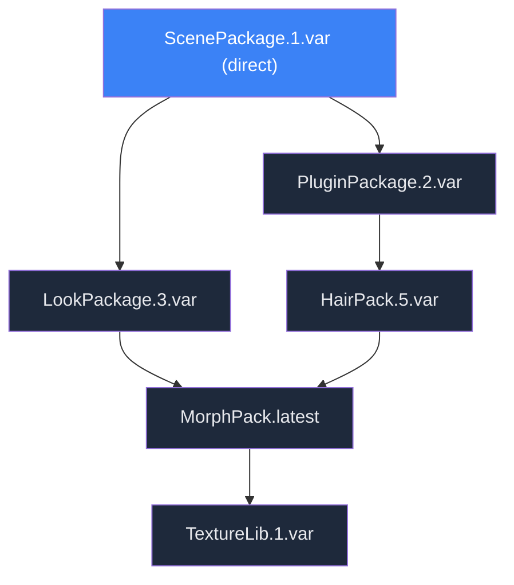
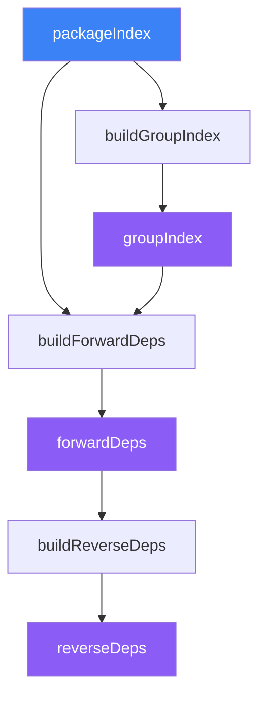
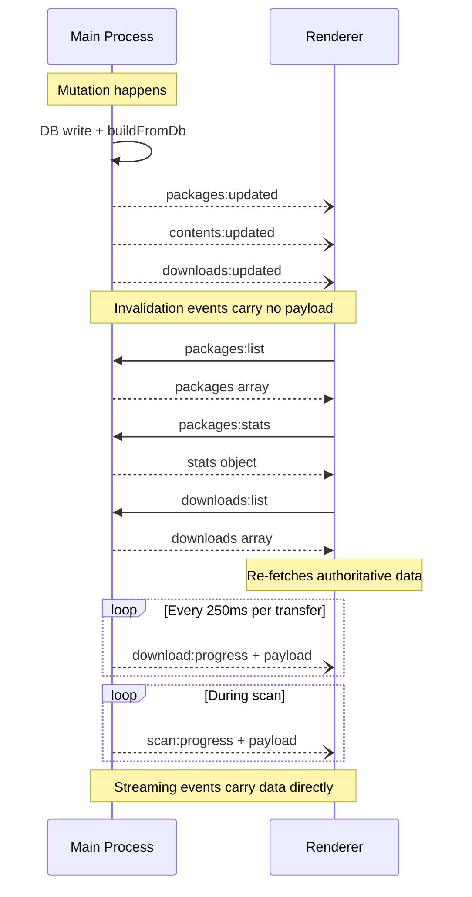
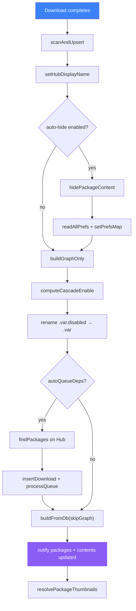

# VaM Backstage — Implementation Documentation

## 1. What Was Built

VaM Backstage is a desktop application for managing Virt-a-Mate (VaM) `.var` packages. VaM uses ZIP-based packages containing scenes, looks, plugins, morphs, and other content. These packages form dependency trees, but VaM itself does not distinguish between packages the user chose to install and packages that exist only because something depends on them. This leads to a cluttered content browser where dependency content (morphs, plugins, clothing, etc.) pollutes the user's view.

VaM Backstage solves this by:

- **Differentiating direct installs from dependencies.** On first scan, a graph-based leaf-detection algorithm classifies packages. Users can promote/demote packages manually afterward.
- **Auto-hiding dependency content in VaM's content browser.** The app manages `.hide`/`.fav` sidecar files that VaM reads natively, making dependency content invisible in VaM without modifying any package files.
- **Providing a full package browser with Hub integration.** Users can search, browse, and install packages from the VaM Hub, with dependency resolution and concurrent downloads.
- **Content inspector.** A flat gallery of all content items across all packages with visibility/favorite controls.
- **Package removal with dependency cascade.** Uninstalling a package identifies orphan dependencies and optionally removes them.

The application is built with Electron 39, React 19, SQLite (better-sqlite3), Zustand for state management, and Tailwind CSS v4 with shadcn/ui-style components (via the `shadcn` CLI and `radix-ui` primitives). It is JavaScript-only (no TypeScript). The UI is dark-only.

---

## 2. User Experience

### First Launch

1. The app auto-detects the VaM directory by probing common locations around the app's working directory for an `AddonPackages` folder, and counts `.var` files under it for the welcome UI. Detection internals are covered in §11.
2. A first-run wizard opens (see `FirstRun.jsx`):
   - **Beta step**: Short beta disclaimer; user continues to welcome.
   - **Welcome step**: Shows detected VaM directory, `.var` file count, "Scan library" CTA, option to change directory.
   - **Scanning step**: Weighted progress across the four local-scan phases (see §11), followed by Hub metadata enrichment and a `hub-finalize` tail.
   - **Unhandled step** (only if some `.var` files were skipped as unreadable): Summary of skipped files; user continues to setup or done.
   - **Setup step** (if at least one package was indexed): "Found X packages — Y direct, Z dependencies." Choice: "Hide dependency content" (recommended) vs "Keep everything visible."
   - **Done step**: Stats summary, "Open VaM Backstage."
3. If no packages on disk, the setup step is skipped; auto-hide is enabled by default.

### Steady-State Usage

- **Hub**: Browse VaM Hub packages with full-text search, type/pricing/author/tag/license filters, and sort options. Click a card to see a detail panel (left) with an embedded webview showing the actual Hub page (right). Install triggers download of the package plus all missing dependencies.
- **Library**: Browse installed packages as a gallery (compact/detailed cards) or table. Select a package to see a detail panel with content list, dependency tree, dependents, and actions (uninstall/promote/demote/disable/force-remove). Missing dependencies section shows broken packages with install actions.
- **Content**: Browse all content items flat across packages as a gallery or table. Select an item to see the owning package, toggle hidden/favorite. Cross-navigate to Library or Hub.
- **Downloads**: Slide-in panel (between ribbon and content area) showing active/queued/completed/failed downloads with live progress, speed, and ETA. Pause/resume all, cancel, retry.
- **Settings**: VaM directory configuration, library rescanning, integrity verification, auto-hide toggle, thumbnail blur (privacy), developer options.
- **Status bar**: Always-visible bottom strip with package count, dependency count, content items, total size, active download progress, scan progress, and app version.

### Cross-Navigation

- Hub card → "View in Library" → Library view with that package selected
- Library detail → compass icon → Hub view with that package's detail
- Library content section → "View in gallery" → Content view filtered by that package
- Content detail → "Library" / "Hub" buttons → jump to respective view

---

## 3. Architecture

```
┌───────────────────────────────────────────────────────────┐
│                    Renderer Process                       │
│                                                           │
│  App.jsx (shell, ribbon, view switching)                  │
│  ├── HubView / LibraryView / ContentView / SettingsView   │
│  ├── DownloadsPanel                                       │
│  ├── FirstRun (first-run wizard)                          │
│  ├── StatusBar                                            │
│  └── Zustand Stores (hub, library, content, downloads,    │
│       installed, status)                                  │
│                                                           │
│  ──── contextBridge (src/preload/index.js) ────           │
├───────────────────────────────────────────────────────────┤
│                       Main Process                        │
│                                                           │
│  index.js ── startup orchestration                        │
│  ├── db.js ── SQLite persistence layer                    │
│  ├── store.js ── in-memory indexes & computed state       │
│  ├── scanner/ ── .var reading, classification, graph      │
│  ├── hub/ ── Hub API client + CDN index                   │
│  ├── downloads/ ── concurrent download engine             │
│  ├── vam-prefs.js ── .hide/.fav sidecar management        │
│  ├── watcher.js ── FS monitoring (chokidar + fs.watch)    │
│  ├── thumb-resolver.js ── Hub thumbnail fetching          │
│  ├── avatar-cache.js ── Hub author avatar caching         │
│  ├── updater.js ── electron-updater wiring (§21)          │
│  └── ipc/ ── handler modules per domain                   │
└───────────────────────────────────────────────────────────┘
```

### Data Flow

On startup, the main process reads SQLite and the filesystem, then builds in-memory structures (package index, dependency graph, content list, prefs map). On changes (FS watcher events, user actions, download completions), the main process writes to SQLite, rebuilds affected in-memory structures, and pushes invalidation events to the renderer, which re-fetches via IPC and re-renders.

**Read paths — in-memory vs SQLite:**

| Handler domain                  | Source of truth at read time                         |
| ------------------------------- | ---------------------------------------------------- |
| `packages:*` list/detail/stats  | in-memory (via `buildFromDb()`)                      |
| `contents:*` list/counts        | in-memory                                            |
| `settings:get` / `settings:set` | SQLite                                               |
| `downloads:list`                | SQLite (persisted queue rows)                        |
| `thumbnails:get`                | SQLite (paths + prefs helpers)                       |
| `hub:*`                         | Hub API + `hub_resources` / `hub_users` cache tables |

<!-- maintainer: this split is referenced by §8 and §16; update here when changing which paths are in-memory vs SQLite. -->

### IPC Contract

Communication between the two processes uses two patterns (arrows are elided from the diagram above):

- **Request-response**: renderer calls `ipcRenderer.invoke` (exposed as `window.api.*` by the preload script) and awaits a result from `ipcMain.handle` in main.
- **Events**: main pushes notifications via `webContents.send`, the renderer subscribes with `ipcRenderer.on`. Used for download progress, invalidation signals, and scan progress.

---

## 4. Component Tree

```
App.jsx
├── Ribbon (56px left nav, fixed)
│   ├── NavButton: Hub (Compass icon)
│   ├── NavButton: Library (Library icon)
│   ├── NavButton: Content (LayoutGrid icon)
│   ├── NavButton: Downloads (Download icon, badge: active+queued count, error count)
│   └── NavButton: Settings (Settings icon)
├── DownloadsPanel (340px slide-in, between ribbon and content)
│   ├── Section: In-flight (active + queued, sorted: direct first)
│   │   └── DownloadRow × N (progress bar, speed, ETA, pause/cancel)
│   ├── Section: Completed (most recent first, max 5 + expand)
│   └── Section: Failed (retry/remove individual, retry all)
├── Main Content Area (flex-1)
│   ├── HubView
│   │   ├── FilterPanel (resizable left)
│   │   ├── Toolbar (count + card size toggle)
│   │   ├── HubCard gallery (infinite scroll, default 220px cards, minimal/medium modes)
│   │   └── HubDetail (replaces gallery on card click)
│   │       ├── BackBar (breadcrumb)
│   │       ├── PackageInfoPanel (320px left, scrollable)
│   │       │   ├── Hero image, name, author card, badges
│   │       │   ├── Stats, dates, description
│   │       │   ├── Action button (Install/Installed/Add to Library)
│   │       │   └── DepTree (expandable, DepRow × N with status tags)
│   │       └── EmbeddedBrowser (flex-1, Electron <webview>)
│   │           ├── BrowserToolbar (back/forward/reload + URL bar)
│   │           └── TabBar (Overview/Reviews/History/Discussion)
│   ├── LibraryView
│   │   ├── FilterPanel (resizable left)
│   │   ├── Toolbar (count + Install All Missing + view toggle)
│   │   ├── VirtualGrid / Table (LibraryCard or LibraryTableRow × N)
│   │   └── LibraryDetailPanel (resizable right, 260–500px)
│   │       ├── Header (thumb, name, version, author, badges, Hub link)
│   │       ├── Actions (uninstall/promote/force-remove/disable, contextual)
│   │       ├── Description
│   │       ├── Dependencies (DepRow × N, "Install missing" action)
│   │       ├── Dependents (expandable list)
│   │       └── ContentCategory groups (collapsible, Eye/Star toggles per item)
│   ├── ContentView
│   │   ├── FilterPanel (resizable left)
│   │   ├── Toolbar (count + view toggle + thumbnail size slider)
│   │   ├── VirtualGrid / Table (ContentCard × N, variable size)
│   │   └── ContentDetailPanel (resizable right, 220–450px)
│   │       ├── ItemHeader (thumb, name, type badge, custom tag, Eye/Star)
│   │       ├── PackageInfo (thumb, name, author, version, badges)
│   │       ├── CrossNav (Library + Hub buttons)
│   │       └── MoreFromPackage (grouped by type, clickable items)
│   └── SettingsView
│       ├── VaM Directory (path + browse)
│       ├── Library Management (stats, rescan, integrity check)
│       ├── Content Visibility (auto-hide toggle)
│       ├── Privacy (thumbnail blur toggle)
│       └── Developer (Hub debug logging, nuke database)
├── FirstRun (modal overlay, 480px card)
│   ├── BetaWarningStep
│   ├── WelcomeStep (directory picker, file count)
│   ├── ScanningStep (weighted progress: local scan + Hub enrichment)
│   ├── UnhandledVarFilesStep (if any .var files skipped as unreadable)
│   ├── SetupStep (hide deps choice)
│   └── DoneStep (stats, open button)
├── StatusBar (28px bottom)
│   ├── Counts (packages, deps, items, size — with tooltips)
│   ├── Download/Scan progress (bar + info, only when active)
│   └── Version label
├── ToastContainer (bottom-right, animated notifications)
├── ErrorBoundary (catches render errors with retry)
└── Action Dialogs (AlertDialog-based confirmation modals)
```

---

## 5. Design System

### Color Palette (Dark-Only)

| Token            | Hex       | Usage                    |
| ---------------- | --------- | ------------------------ |
| `base`           | `#0a0b10` | App background           |
| `surface`        | `#111218` | Card/panel backgrounds   |
| `elevated`       | `#191a22` | Raised surfaces          |
| `hover`          | `#1f2029` | Hover states, borders    |
| `active`         | `#272833` | Active/pressed states    |
| `border-bright`  | `#2e303b` | Prominent borders        |
| `text-primary`   | `#e8e9ed` | Primary text             |
| `text-secondary` | `#82849a` | Secondary text           |
| `text-tertiary`  | `#4e5064` | Muted text, placeholders |
| `accent-blue`    | `#4a91f1` | Primary accent           |
| `accent-pink`    | `#ef5bed` | Secondary accent         |
| `accent-purple`  | `#8b5cf6` | Tertiary accent          |
| `success`        | `#34d399` | Positive states          |
| `warning`        | `#fbbf24` | Warning states           |
| `error`          | `#f87171` | Error states             |

Colors are defined as CSS custom properties in `main.css` via `@theme` and consumed through Tailwind utilities (`bg-base`, `text-text-secondary`, `border-accent-blue`, etc.).

### Content Type Colors

| Type       | Color              |
| ---------- | ------------------ |
| Scenes     | `#3b82f6` (blue)   |
| Looks      | `#ec4899` (pink)   |
| Clothing   | `#8b5cf6` (purple) |
| Hairstyles | `#f59e0b` (amber)  |
| Poses      | `#f97316` (orange) |
| SubScenes  | `#06b6d4` (cyan)   |

An `Other` category covers non-core package types with a neutral gray.

### Custom CSS Utilities

- `.gradient-text` — blue-to-pink text gradient via `background-clip: text`
- `.gradient-border` — blue-to-pink border using mask-composite trick
- `.btn-gradient` — gradient button (blue-to-purple) with lift on hover
- `.card-glow` — blue-tinted box-shadow on hover
- `.skeleton` — shimmer loading animation
- `.progress-bar` — animated gradient background for download bars
- `.spin-slow` — slow CSS rotation

### Procedural Gradients

Three deterministic gradient functions generate unique visual identities from string inputs:

- **`getGradient(id)`**: For packages — produces a 3-layer gradient (2 radial + 1 linear) from a deterministic string hash of `id` (e.g. filename). Each layer varies hue, saturation, and position from that hash.
- **`getContentGradient(name, type)`**: For content items — same 3-layer approach but biased toward the content type's hue, with the item name adding variation.
- **`getAuthorColor(author)`**: For author avatars — a single HSL color derived from the author name hash.

All gradients are computed client-side with no server dependency and serve as the immediate visual fallback while real thumbnails load asynchronously.

### Other Visual Details

- **Typography**: Geist Variable font (system sans-serif fallback); `user-select: none` by default for an app-chrome feel.
- **Scrollbars**: custom 6px — transparent track, `border-bright` thumb, `text-tertiary` on hover, 3px border-radius.
- **Privacy mode**: when enabled, `html[data-blur-thumbs]` triggers a strong CSS blur filter on all `.thumb` elements.

---

## 6. Shared Type System

Content types are defined in `src/shared/content-types.js` and shared between main and renderer processes.

### Exact Types → UI Categories

The classifier produces fine-grained "exact types" from file paths inside `.var` ZIP files. These are collapsed into user-facing categories with one of three visibility levels:

- **Visible** — shown in the Content gallery
- **Detail-only** — shown in the package detail panel but not the main Content gallery
- **Hidden** — detected and counted, never shown

| Exact Type       | UI Category | Visibility  | Path pattern                                             |
| ---------------- | ----------- | ----------- | -------------------------------------------------------- |
| `scene`          | Scenes      | Visible     | `Saves/scene/*.json`                                     |
| `legacyScene`    | Scenes      | Visible     | `Saves/scene/*.vac`                                      |
| `subscene`       | SubScenes   | Detail-only | `Custom/SubScenes/*.json`                                |
| `look`           | Looks       | Visible     | `Custom/Atom/Person/Appearance/*.vap`                    |
| `legacyLook`     | Looks       | Visible     | `Saves/Person/Appearance/*.json`                         |
| `skinPreset`     | Looks       | Visible     | `Custom/Atom/Person/Skin/*.vap`                          |
| `pose`           | Poses       | Visible     | `Custom/Atom/Person/Pose/*.vap`                          |
| `legacyPose`     | Poses       | Visible     | `Saves/Person/Pose/*.json`                               |
| `clothingItem`   | Clothing    | Visible     | `Custom/Clothing/*` (.vab/.vaj/.vam)                     |
| `clothingPreset` | Clothing    | Visible     | `Custom/Atom/Person/Clothing/*.vap`                      |
| `hairItem`       | Hairstyles  | Visible     | `Custom/Hair/*` (.vab/.vaj/.vam)                         |
| `hairPreset`     | Hairstyles  | Visible     | `Custom/Atom/Person/Hair/*.vap`                          |
| `atomPreset`     | —           | Hidden      | other `Custom/<Category>/*.vap`                          |
| `pluginScript`   | —           | Hidden      | `Custom/Scripts/*.cs`                                    |
| `scriptList`     | —           | Hidden      | `Custom/Scripts/*.cslist`                                |
| `pluginPreset`   | —           | Hidden      | `Custom/Atom/Person/Plugins/*.vap`                       |
| `morphBinary`    | —           | Hidden      | `Custom/Atom/Person/Morphs/*.vmi`                        |
| `assetbundle`    | —           | Hidden      | `Custom/(Assets?\|Sounds?\|Audio)/`, any `*.assetbundle` |
| `audio`          | —           | Hidden      | `Custom/(Sounds?\|Audio)/*`                              |
| `texture`        | —           | Hidden      | `Custom/Atom/Person/Textures/*`                          |

### Custom Tags

Some exact types get a UI tag to distinguish them within their category:

- `legacyScene`, `legacyLook`, `legacyPose` → "Legacy" (amber)
- `skinPreset` → "Skin Preset" (sky blue)
- `clothingPreset`, `hairPreset` → "Preset" (sky blue)

### Content Deduplication

Within a single package, duplicate content items (same stem, same type) are collapsed. The highest-priority file extension wins — a clothing/hair item is defined across three companion files (`.vam` holds the metadata manifest, `.vaj` the material bindings, `.vab` the binary mesh), and picking the manifest as the canonical entry matches how VaM itself keys the item:

- For clothing/hair: `.vam` > `.vaj` > `.vab`
- For morphs: `.vmi` > `.dsf` > `.vmb` (see classifier `prefer` order)
- Clothing/hair item + preset pairs are merged (item has priority)

Cross-package deduplication also occurs: when multiple versions of the same package exist, content with the same stem and type keeps only the entry from the highest-versioned package. This prevents duplicate content items in the gallery when multiple versions coexist.

---

## 7. Database Schema

SQLite with WAL journaling, managed by `better-sqlite3` in the main process. Current schema version: **21**. New databases are created at the latest version in one step (`createSchema` in `db.js`); existing DBs walk forward through incremental steps in `migrate()` (v17 → v18 → v19 → v20 → v21). Pre-release builds at versions 1–15 cannot be upgraded — delete `backstage.db` under the app userData directory if you hit that error. The `__local__` sentinel package row that owns loose Saves/Custom content (see §7.x and §11) is seeded by `ensureLocalPackage()` on every open — no schema change, just an idempotent data fixup that works on both new installs and existing DBs.

### `packages` — Package Scan Cache

One row per `.var` file on disk. If `file_mtime` + `size_bytes` match what's on disk, the ZIP is not re-read on rescan.

```sql
CREATE TABLE packages (
  filename         TEXT PRIMARY KEY,  -- "Creator.Package.123.var"
  creator          TEXT NOT NULL,
  package_name     TEXT NOT NULL,     -- group key: "Creator.Package"
  version          TEXT NOT NULL,     -- text, not int (some versions are non-numeric)
  type             TEXT,              -- primary content category (Scenes, Looks, etc.)
  title            TEXT,              -- display name from meta.json
  description      TEXT,
  license          TEXT,              -- Creative Commons license string
  size_bytes       INTEGER NOT NULL,
  file_mtime       REAL NOT NULL,     -- fractional seconds since epoch
  is_direct        INTEGER NOT NULL DEFAULT 0,  -- 1=user installed, 0=dependency
  storage_state    TEXT NOT NULL DEFAULT 'enabled',  -- 'enabled' | 'disabled' | 'offloaded'
  library_dir_id   INTEGER REFERENCES library_dirs(id) ON DELETE RESTRICT,  -- NULL = main AddonPackages
  hub_resource_id  TEXT,              -- VaM Hub resource ID (learned from Hub API)
  hub_user_id      TEXT,              -- Hub user ID for author avatar
  hub_display_name TEXT,              -- Hub display title (often differs from meta title)
  hub_tags         TEXT,              -- JSON array of Hub tag strings
  promotional_link TEXT,              -- external link (Patreon, etc.)
  image_url        TEXT,              -- Hub CDN thumbnail URL
  thumb_checked    INTEGER NOT NULL DEFAULT 0,  -- legacy; see "Legacy Fields" below
  type_override    TEXT,              -- user-set type override (null=auto-detected)
  is_corrupted     INTEGER NOT NULL DEFAULT 0,  -- 1=failed integrity check
  dep_refs         TEXT NOT NULL DEFAULT '[]',  -- JSON array of raw dep ref strings
  first_seen_at    INTEGER NOT NULL DEFAULT (unixepoch()),
  scanned_at       INTEGER
);
CREATE INDEX idx_packages_package_name ON packages(package_name);
CREATE INDEX idx_packages_creator ON packages(creator);
```

`storage_state` replaces the legacy `is_enabled` boolean (v21). It encodes three physical placements:

| state       | location                                              | on-disk name (canonical) |
| ----------- | ----------------------------------------------------- | ------------------------ |
| `enabled`   | main `AddonPackages` (`library_dir_id IS NULL`)       | `Foo.1.var`              |
| `disabled`  | main `AddonPackages` (`library_dir_id IS NULL`)       | `Foo.1.var.disabled`     |
| `offloaded` | a registered aux library directory (`library_dir_id`) | `Foo.1.var`              |

For dependency-graph purposes, `disabled` and `offloaded` behave identically (the package is unavailable to VaM at runtime). On-disk names are fully derived from `storage_state`: `disabled` carries the `.var.disabled` suffix; `enabled` and `offloaded` are suffix-less. Aux dirs are normalized — any externally-placed `.var.disabled` found in an aux dir is renamed to bare `.var` (or unlinked if a bare sibling already exists) by both the scanner and the watcher on first observation, so `pkgVarPath()` can rebuild the path from `(library_dir_id, filename, storage_state)` alone.

All app-initiated transitions go through `applyStorageState` in `src/main/storage-state.js`, which performs an `fs.rename`, updates the DB row (`storage_state` + `library_dir_id`), patches the in-memory store, and suppresses the watcher for both source and dest paths. Aux dirs are guaranteed to be on the same filesystem as main `AddonPackages` (validated by a probe-rename on registration in `ipc/library-dirs.js`), so a plain rename is always sufficient — cross-disk offload is intentionally out of scope for v1. External (watcher-observed) transitions are reconciled separately and never go through `applyStorageState`.

### `library_dirs` — Offload Library Directories

Registered offload directories. Main `AddonPackages` is implicit (derived from `vam_dir`) and represented by `packages.library_dir_id IS NULL`; only aux dirs live in this table.

```sql
CREATE TABLE library_dirs (
  id         INTEGER PRIMARY KEY AUTOINCREMENT,
  path       TEXT UNIQUE NOT NULL,
  created_at INTEGER NOT NULL DEFAULT (unixepoch())
);
```

The scanner walks every registered library dir; the watcher monitors all of them; a package moved between dirs by an external tool is reconciled as a move (single update of `storage_state` + `library_dir_id`) rather than uninstall + reinstall. Removing an aux dir is allowed only when no packages still point at it (`ON DELETE RESTRICT`). Aux dirs must live on the same filesystem as main `AddonPackages` — `library-dirs:add` runs a probe-rename and rejects cross-disk paths; cross-filesystem offload is deferred to v2.

### `contents` — Content Item Scan Cache

Content items discovered inside `.var` files. Avoids re-reading ZIPs on restart.

```sql
CREATE TABLE contents (
  id                INTEGER PRIMARY KEY AUTOINCREMENT,
  package_filename  TEXT NOT NULL REFERENCES packages(filename) ON DELETE CASCADE,
  internal_path     TEXT NOT NULL,     -- path within the .var ZIP
  display_name      TEXT NOT NULL,     -- human-readable name from path
  type              TEXT NOT NULL,     -- exact type (scene, look, clothingItem, etc.)
  thumbnail_path    TEXT,              -- sibling .jpg path inside the .var ZIP (nullable)
  UNIQUE(package_filename, internal_path)
);
CREATE INDEX idx_contents_package ON contents(package_filename);
CREATE INDEX idx_contents_type ON contents(type);
```

### `downloads` — Persistent Download Queue

Survives crash/restart. Live progress (speed, %) is in-memory only. On startup, `status='active'` and `status='queued'` rows are marked `'failed'` with `error='Interrupted'` (temp files are cleaned up first); the user can retry them manually.

```sql
CREATE TABLE downloads (
  id               INTEGER PRIMARY KEY AUTOINCREMENT,
  package_ref      TEXT NOT NULL UNIQUE,  -- package filename or ref being downloaded
  hub_resource_id  TEXT,
  download_url     TEXT,
  file_size        INTEGER,
  priority         TEXT NOT NULL DEFAULT 'dependency',  -- 'direct' or 'dependency'
  parent_ref       TEXT,              -- which direct install triggered this dependency
  display_name     TEXT,              -- human-readable name for UI
  status           TEXT NOT NULL DEFAULT 'queued',  -- queued|active|completed|failed|cancelled
  temp_path        TEXT,              -- .var.tmp path during download
  error            TEXT,              -- error message if failed
  created_at       INTEGER NOT NULL DEFAULT (unixepoch()),
  completed_at     INTEGER,
  auto_queue_deps  INTEGER NOT NULL DEFAULT 1  -- auto-queue transitive missing deps
);
```

### `hub_resources` — Hub API Response Cache

Persists full Hub resource JSON blobs so Library view can enrich dep status without network calls.

```sql
CREATE TABLE hub_resources (
  resource_id  TEXT PRIMARY KEY,
  hub_json     TEXT,        -- full JSON blob from Hub detail API
  search_json  TEXT,        -- cached search/list JSON for this resource
  find_json    TEXT,        -- cached find JSON for this resource
  updated_at   INTEGER NOT NULL DEFAULT (unixepoch())
);
```

### `hub_users` — Hub User Cache

Caches Hub user metadata for author display.

```sql
CREATE TABLE hub_users (
  user_id   TEXT PRIMARY KEY,
  username  TEXT,
  hub_json  TEXT,           -- full JSON blob
  updated_at INTEGER NOT NULL DEFAULT (unixepoch())
);
CREATE INDEX idx_hub_users_username ON hub_users(username);
```

### `settings` — Key-Value Configuration

```sql
CREATE TABLE settings (
  key   TEXT PRIMARY KEY,
  value TEXT
);
```

**Notable settings keys**:

- `vam_dir` — VaM installation root path
- `initial_scan_done` — `'1'` after first scan completes
- `needs_rescan` — `'1'` to force rescan on next startup (cleared after startup scan)
- `needs_prefs_migration` — `'1'` to trigger sidecar file extension migration
- `auto_hide_deps` — `'1'` to auto-manage `.hide` files for dependency content
- `hub_debug_requests` — `'1'` to log all Hub API requests
- `hub_filters_json` — cached Hub filter metadata (types, tags, sort options)
- `blur_thumbnails` — `'1'` when thumbnail blur (privacy) is enabled
- `update_channel` — `'stable'` | `'dev'`; selects updater feed (see §21)
- `disable_behavior` — `'suffix'` (rename to `.var.disabled` in main; default) or `'move-to:<auxDirId>'` (move to the named aux library directory). Removing the referenced aux dir resets this to `'suffix'`.

### Legacy Fields

- `packages.thumb_checked` is still written when a Hub thumbnail is stored but is no longer read; the thumb resolver selects on `image_url IS NULL` instead. The column stays for backward compatibility with the on-disk schema.

### Local content sentinel (`__local__`)

Loose user files under `vamDir/Saves` and `vamDir/Custom` (scenes, looks, poses, presets, morphs, plugins, …) are indexed into the same `contents` table used for packaged content, but the table requires `package_filename` to point at a real `packages` row. To avoid a schema-wide nullable column or a separate join table, every install gets a synthetic row with `filename = '__local__'` (creator/`package_name`/`version` empty, `is_direct = 1`, `storage_state = 'enabled'`, `library_dir_id = NULL`). Loose-content rows reference this sentinel.

The sentinel is filtered out of every user-visible iteration in `store.js` via `userPackageEntries()` / `userPackageValues()` — it never appears in the Library view, in package facets, or in stats. Internal code that joins from `contents.package_filename` back to a package (scene reader, thumbnail resolver, content-by-package lookups) still sees it via the unfiltered `packageIndex`. `db.js#ensureLocalPackage()` is idempotent and runs from `migrate()` on every open, so the sentinel re-appears even if it was manually deleted.

Loose `.hide` / `.fav` sidecars live next to the source file (e.g. `Saves/scene/Foo/Foo.json.hide`), matching VaM's native convention; this differs from the `AddonPackagesFilePrefs/{stem}/...` layout used for packaged content. `vam-prefs.js` picks the right layout based on `packageFilename === '__local__'`.

### Future migrations

To evolve the schema, bump `SCHEMA_VERSION` and add an incremental step in `migrate()` after the `createSchema` / legacy-cutoff logic. New installs go through `createSchema` directly at the latest version, so any new column or table must be reflected in **both** places — leaving them out of `createSchema` will diverge new installs from upgraded ones. Migrations should be idempotent for the post-`createSchema` path so fresh installs running each step in turn end up identical to upgraded ones. Existing increments:

- **16** → **17**: adds `contents.person_atom_ids` and zeroes `packages.file_mtime` so the next scan re-reads every package once.
- **17** → **18**: adds `contents.file_mtime` + `contents.size_bytes` so the loose-content scanner can mtime-gate scene re-parses (var-owned rows leave both at 0; the package-level gate covers them).
- **18** → **19**: adds `packages.hub_detail_applied_at` so `scanHubDetails` can skip rows whose cached Hub detail has already been applied.
- **19** → **20**: introduces user-defined Labels (`labels`, `label_packages`, `label_contents`). `label_contents` keys on `(package_filename, internal_path)` rather than `contents.id` because `contents` rows can be REPLACEd during rescans.
- **20** → **21**: introduces `library_dirs` and replaces `packages.is_enabled` (BOOL) with `packages.storage_state` (TEXT) + `packages.library_dir_id` (FK). Backfills `storage_state` from `is_enabled` (`1 → 'enabled'`, `0 → 'disabled'`), drops `is_enabled`, and sets `needs_rescan` so the next startup picks up any externally-placed files in newly registered aux dirs. The on-disk `.disabled` suffix is implied by `storage_state` (aux dirs are normalized to suffix-less `.var` on first observation), so no separate column tracks it.

---

## 8. In-Memory Structures

All library business logic — filtering, sorting, dependency resolution, content aggregation — runs against in-memory structures built on startup from SQLite and the filesystem. These back the `packages:*` and `contents:*` read paths; see §3 for the full read-path split.

### Core Indexes

| Structure                | Type                                           | Description                                                |
| ------------------------ | ---------------------------------------------- | ---------------------------------------------------------- |
| `packageIndex`           | `Map<filename, PackageObj>`                    | All packages keyed by filename                             |
| `groupIndex`             | `Map<packageName, filename[]>`                 | Package group → all version filenames                      |
| `forwardDeps`            | `Map<filename, [{ref, resolved, resolution}]>` | Resolved dependency edges per package                      |
| `reverseDeps`            | `Map<filename, Set<filename>>`                 | Reverse edges: who depends on this package                 |
| `contentItems`           | `Array<ContentItem>`                           | All gallery-visible content items                          |
| `contentItemsDeduped`    | `Array<ContentItem>`                           | Cross-version deduplicated content                         |
| `contentByPackage`       | `Map<filename, ContentItem[]>`                 | Content grouped by owning package                          |
| `prefsMap`               | `Map<"filename/path", {hidden, favorite}>`     | Visibility/favorite state from sidecar files               |
| `morphCountByPackage`    | `Map<filename, number>`                        | Morph count per package                                    |
| `aggregateMorphCountMap` | `Map<filename, number>`                        | Morph count including transitive dependencies              |
| `removableSizeMap`       | `Map<filename, number>`                        | Bytes freed if package is uninstalled                      |
| `orphanSet`              | `Set<filename>`                                | Direct packages with no reverse deps (considering cascade) |
| `directOrphanSet`        | `Set<filename>`                                | Direct packages with strictly zero reverse deps            |
| `tagCounts`              | `{tag: count}`                                 | Hub tag occurrence counts across packages                  |
| `authorCounts`           | `{creator: count}`                             | Author occurrence counts                                   |
| `creatorsNeedingUserId`  | `Map<normalized, filenames[]>`                 | Authors missing Hub user IDs                               |
| `stats`                  | `StatsObj`                                     | Aggregate counts and sizes                                 |

### Stats Object

```javascript
{
  directCount,      // packages with is_direct=1
  depCount,         // packages with is_direct=0
  totalCount,       // all packages
  brokenCount,      // packages with at least one missing dependency
  totalContent,     // total gallery-visible content items
  totalSize,        // sum of all package sizes
  directSize,       // sum of direct package sizes
  depSize,          // sum of dependency package sizes
  contentByType,    // { Scenes: N, Looks: N, ... }
  missingDepCount,  // unique missing dependency references
}
```

### Build Process

`buildFromDb({ skipGraph } = {})` is the central rebuild function:

1. Load all packages and contents from SQLite
2. If `!skipGraph`: build `groupIndex`, resolve all `forwardDeps`, compute `reverseDeps`
3. Merge `prefsMap` into content items (hidden/favorite state)
4. Deduplicate content across package versions (same stem + type → highest version wins)
5. Compute `removableSizeMap` for every package
6. Compute morph counts (own + transitive)
7. Compute orphan sets
8. Aggregate `stats`, `tagCounts`, `authorCounts`

`refreshPackage(filename)` and `refreshAll()` are thin wrappers around `buildFromDb()` — they exist as named call sites for incremental changes (FS watcher events, post-download), but today they always trigger a full rebuild. The `skipGraph` fast path is used directly by callers that know the graph is unchanged (e.g. enable/disable toggles, type overrides).

---

## 9. Dependency Graph

### Conceptual Model

VaM packages declare dependencies in `meta.json`. VaM Backstage resolves these into a directed acyclic graph (with cycle tolerance) connecting every installed package to the packages it requires.



The graph answers four kinds of questions:

1. **What does this package need?** (forward deps — for install/enable)
2. **What needs this package?** (reverse deps — for uninstall/disable safety)
3. **What becomes orphaned?** (removable deps — for cleanup)
4. **What is this package's role?** (leaf detection — direct vs dependency)

### Parsing

Dependency references in `meta.json` can be a dictionary (`{"Author.Pkg.123": "url"}`) or array (`["Author.Pkg.123"]`). Each ref is a string like `"Creator.Package.123"`, `"Creator.Package.latest"`, or `"Creator.Package.minN"` (at least version N). Self-references are filtered out; `.latest` / `.minN` casing is normalized. The function `parseDepRef(ref)` extracts `{creator, packageName, version, minVersion?, raw}` where `version` is numeric digits, the literal `'latest'`, or `'min'` (with `minVersion` holding the integer floor). A `.var` file on disk with a flexible version segment is never valid — only dep refs carry those tokens.

### Graph Construction

Building the full graph is a three-step pipeline that runs synchronously on the main thread:



| Step                 | Input                         | Output        | Description                                                          |
| -------------------- | ----------------------------- | ------------- | -------------------------------------------------------------------- |
| `buildGroupIndex()`  | `packageIndex`                | `groupIndex`  | Groups filenames by `packageName` for `.latest` / `.minN` resolution |
| `buildForwardDeps()` | `packageIndex` + `groupIndex` | `forwardDeps` | Resolves each dep ref to a local filename or `missing`               |
| `buildReverseDeps()` | `forwardDeps`                 | `reverseDeps` | Inverts forward edges — for each resolved dep, records the dependent |

These three steps together are exposed as `buildGraphOnly()` — a helper called by the scanner's `graph` phase (§11) and the post-download cascade (§16) when the graph needs to be rebuilt without also recomputing the aggregates in `buildFromDb()`.

**Performance note**: The entire graph rebuild is O(P × D) where P = packages and D = average deps per package. No incremental graph patching exists — the full graph is rebuilt from scratch on any structural change. For concrete timings see §16 "Data Staleness and Consistency."

### Resolution

`resolveRef(ref, packageIndex, groupIndex)` resolves each declared dependency:

1. **Exact match** (numeric refs only — flexible refs skip this step): Look up `"Creator.Package.123.var"` or `"Creator.Package.123"` in `packageIndex`
2. **Group lookup**: Find `"Creator.Package"` in `groupIndex`, pick the highest numeric version via `pickHighestVersion()`. For `.latest` this is the expected behavior; for `.minN` the same pass runs with a floor filter (`v >= minVersion`); for versioned refs, this is a fallback.
3. Return `{resolved: filename|null, resolution: 'exact'|'latest'|'fallback'|'missing'}`

`.minN` reuses the `'latest'` machinery with a floor. When at least one local version `>= N` exists, the ref resolves to the highest such version and is reported as `'latest'`. If the group is present but no version meets the floor, the highest available is returned as `'fallback'` (amber), surfacing it in the missing-deps UI so the user can install a version that satisfies the constraint.

### Resolution States in UI

| Resolution                | Condition                                                       | UI Display             |
| ------------------------- | --------------------------------------------------------------- | ---------------------- |
| `exact`                   | Declared version found locally                                  | "Installed" (green)    |
| `fallback`                | Different version of same group on disk (incl. below `.minN`)   | "Fallback" (amber)     |
| `latest`                  | `.latest` / satisfied `.minN` resolved to highest local version | "Installed" (green)    |
| `missing` + on Hub (free) | Not local, Hub says available + free                            | "On Hub" (blue)        |
| `missing` + unavailable   | Not local, not on Hub                                           | "Missing" (red)        |
| Downloading               | Active download for this ref                                    | Progress bar animation |
| `queued`                  | Queued for download                                             | "Queued" (pulsing)     |
| `failed`                  | Download failed                                                 | "Failed" (red)         |

### Graph Analysis Algorithms

All algorithms read from `packageIndex`, `forwardDeps`, and `reverseDeps` (built once per rebuild) and use a shared pseudocode style: `set` for unordered membership, `repeat until stable` for fixed points.

#### `getTransitiveDeps` — DFS walk

Called on demand (e.g. uninstall preview) to return the full set of reachable dependency filenames. Uses an explicit stack (`pop` from the end of the array): depth-first order, cycle-safe via a visited set. Same reachable set as BFS; only the traversal order differs.

```
getTransitiveDeps(A):
  visited = empty set
  stack = [A]
  while stack not empty:
    current = stack.pop()
    for dep in forwardDeps[current]:
      if dep.resolved and dep.resolved not in visited:
        visited.add(dep.resolved)
        stack.push(dep.resolved)
  return visited            # does NOT include A itself
```

#### `buildDepTree` — recursive DFS for UI

Produces a nested tree for the Library detail panel. Each node carries resolution status, package metadata, and children. A visited set protects against cycles — when a cycle is hit, children are returned empty.

#### `computeCascadeDisable` — fixed point

When disabling a package, also disable transitive deps that have no other enabled dependents:

```
computeCascadeDisable(target):
  toDisable = empty set
  repeat until stable:
    for dep in transitiveDeps(target):
      if dep in toDisable: skip
      if dep is already disabled: skip
      if every d in reverseDeps[dep] is either target or in toDisable:
        toDisable.add(dep)
  return toDisable
```

The loop is needed because adding a dep may unlock further deps whose only remaining enabled dependent was that dep. Convergence is guaranteed: `toDisable` only grows and is bounded by the transitive dep set.

#### `computeCascadeEnable` — single pass

Return all transitive deps of the package that are currently disabled. When re-enabling a package, its disabled deps are re-enabled unconditionally (they were presumably disabled by a prior cascade-disable).

#### `computeRemovableDeps` — fixed point

When uninstalling a package, identify which deps would become orphans:

```
computeRemovableDeps(target):
  toRemove = {target}
  repeat until stable:
    for dep in transitiveDeps(target):
      if dep in toRemove or dep.is_direct: skip
      if every d in reverseDeps[dep] is in toRemove:
        toRemove.add(dep)
  toRemove.remove(target)   # target handled separately
  return toRemove, sum(sizes)
```

Pre-computed for every package during `buildFromDb()` and cached in `removableSizeMap`, so the Library UI can show "removes X deps, frees Y MB" with no recomputation on hover.

#### `detectLeaves` — initial classification

Packages with zero reverse dependencies are "leaves" of the graph — nothing depends on them. On initial scan, leaves are classified as `is_direct = 1`; everything else starts as `is_direct = 0`.

This heuristic works because in a typical VaM library, packages the user cares about (scenes, looks) sit at the leaves while shared resources (morphs, textures, plugins) sit deeper. Users can promote/demote afterward.

#### `computeOrphanCascade` — fixed point

Identify dependency packages no direct package transitively needs:

```
computeOrphanCascade():
  directOrphans = {p for p in packageIndex if !p.is_direct and reverseDeps[p] is empty}
  toRemove = copy(directOrphans)
  repeat until stable:
    for p in packageIndex where !p.is_direct and p not in toRemove:
      if every d in reverseDeps[p] is in toRemove:
        toRemove.add(p)
  return { orphans: toRemove, directOrphans, totalSize }
```

Two sets are exposed:

- `directOrphanSet` — deps with strictly zero reverse deps (likely leftover from uninstalled packages)
- `orphanSet` — full cascade, including deps whose entire dependent chain consists of other orphans

The Library UI exposes orphans via a filter and a bulk "Remove all orphans" action.

---

## 10. Content Visibility — Sidecar Files

### How VaM Manages Visibility

VaM stores hidden/favorite state as empty sidecar files alongside content items:

```
{vamDir}/AddonPackagesFilePrefs/{packageStem}/{internalPath}.hide
{vamDir}/AddonPackagesFilePrefs/{packageStem}/{internalPath}.fav
```

### Architecture

- **Sidecar files are the single source of truth.** The app never caches visibility state in the database.
- **In-memory prefs map** built on startup by walking the `AddonPackagesFilePrefs` directory. Structure: `Map<"filename/internalPath", {hidden: bool, favorite: bool}>`.
- **FS watcher** monitors the prefs directory to keep the in-memory map current when VaM or the user changes flags externally.
- **IPC handlers** merge content rows with the prefs map before returning to the renderer.

### State Transitions

| Event                           | Effect                                  |
| ------------------------------- | --------------------------------------- |
| Package promoted (dep→direct)   | Delete `.hide` sidecars for all content |
| Package demoted (direct→dep)    | Create `.hide` sidecars for all content |
| User toggles hidden in app UI   | Write/delete `.hide`                    |
| User toggles favorite in app UI | Write/delete `.fav`                     |
| Package installed (direct)      | No sidecars created                     |
| Package installed (dep)         | Create `.hide` sidecars                 |
| External sidecar change         | Prefs map updates via FS watch          |

### Initial Scan Behavior

- **Existing library, user chooses "Hide dependency content"**: For each content item in dependency packages that isn't already hidden, create `.hide`.
- **Existing library, user chooses "Keep everything visible"**: No sidecars modified.
- **Empty directory**: Auto-hide enabled, nothing to process.

---

## 11. Scanner

### Scan Phases

`runScan(vamDir, onProgress)` runs on startup and on user request, emitting phases via `scan:progress` (see `scanner/index.js`):

| Phase        | What it does                                                                                                                                                                                                                          | Key operations                                     |
| ------------ | ------------------------------------------------------------------------------------------------------------------------------------------------------------------------------------------------------------------------------------- | -------------------------------------------------- |
| `indexing`   | Walk every registered library directory (main `AddonPackages/` + any registered aux dirs) recursively for `.var` files; main also accepts `.var.disabled`. Aux-dir `.var.disabled` is normalized to bare `.var` on first observation. | directory traversal                                |
| `reading`    | Per-file: skip if `file_mtime` + `size_bytes` match cache; otherwise read the ZIP, extract `meta.json`, classify and dedup content, write DB rows                                                                                     | `scanAndUpsert`                                    |
| `graph`      | Drop DB rows for files no longer on disk; on initial scan / structural changes, rebuild graph and run leaf detection                                                                                                                  | `buildGraphOnly`, `detectLeaves`, `batchSetDirect` |
| `local`      | Walk `Saves/` and `Custom/` for loose user content; classify with the same rules as packaged content; upsert under the `__local__` sentinel                                                                                           | `runLocalScan`                                     |
| `finalizing` | Optional prefs extension migration; reload prefs; rebuild in-memory state                                                                                                                                                             | `readAllPrefs`, `buildFromDb()`                    |

Hub metadata enrichment is driven separately by the first-run wizard via `wizard:enrich-hub`, which emits `hub-scan:progress` events (`lookup` / `cache` / `fetching` / `hub-finalize`). Outside first-run, enrichment is incremental and background-only.

### `.var` Reader

Uses Node.js `yauzl` to read ZIP files. Extracts:

- `meta.json` from the archive (contains name, version, creator, dependencies, description, license, etc.)
- File list from the central directory (used for content classification and thumbnail path discovery)
- On-demand file extraction for thumbnails and content inspection

### Classifier

Maps internal ZIP paths to exact types using pattern matching. Key rules:

- Path prefixes determine category (`Saves/scene/` → scene, `Custom/Clothing/` → clothing)
- File extensions determine specificity (`.vap` = preset, `.vab`/`.vaj`/`.vam` = item)
- For clothing/hair: `.vam` extension preferred (highest priority in dedup)
- Sibling `.jpg` files are noted as `thumbnail_path` on the content row

### Package Type Derivation

The package's `type` field is set to the first matching visible category found in its content, using `VISIBLE_CATEGORIES` priority order (`Scenes` > `Looks` > `Poses` > `Clothing` > `Hairstyles`). Users can override this via `type_override`.

### Integrity Checking

`verifyPackageFull(varPath)` opens the ZIP, decompresses every entry, and verifies CRC32 against the central directory. Corrupted packages are flagged with `is_corrupted=1` in the database and shown with a "Corrupted" badge in the UI.

### Local Content Scan

`runLocalScan(vamDir)` (in `scanner/local.js`) walks `Saves/` and `Custom/` recursively, builds the same `[{ path, size, mtime }]` shape the `.var` reader produces, and runs it through `classifyContents()` — so loose scenes/looks/poses/clothing/morphs/etc. light up with the same types and sibling-thumbnail logic as their packaged counterparts. Rows are written under `package_filename = '__local__'` (see §7's "Local content sentinel"). For scenes / legacy looks the scan also stores `person_atom_ids` by reading the loose JSON directly (no `SELF:/` rewrite — loose files don't use that prefix).

The loose scan is incremental in the same shape as the var scan, just at item granularity instead of package granularity. The var scanner's `(file_mtime, size_bytes)` gate on `packages` lets it skip an unchanged `.var` end-to-end — no zip open, no classify, no parse, no row writes. The loose scanner does the same with `(file_mtime, size_bytes)` on `contents`: every file is `stat`ed during the walk, and items whose stat **and** classification (display name, type, thumbnail) match the existing row are skipped entirely — no `readFile`, no parse, no DB write. Only changed/new items hit `upsertContents` (`ON CONFLICT DO UPDATE`, preserving `contents.id`); only paths that vanished from disk hit `deleteContentsForPackagePaths`.

The classification fields are part of the gate (not just stat) so that sibling-thumbnail additions still update the row when a content file's own mtime didn't move — `classifyContents` is sibling-aware, so a scene's `thumbnail_path` can shift purely from a `.jpg` being added next to it.

`chokidar` watches `Saves/` and `Custom/` at runtime; content-file events trigger a debounced `runLocalScan`, while sibling `.hide` / `.fav` events update the in-memory `prefsMap` directly without a rescan. The watcher is also how extractor output (`Custom/Atom/Person/.../extracted/*.vap` files written by `scenes/extract.js`) gets indexed — the file event causes a debounced `runLocalScan` like any other loose-file write.

---

## 12. Download Manager

### Architecture

The download manager (`src/main/downloads/manager.js`) handles concurrent package downloads from the VaM Hub.

- **Max 5 concurrent transfers** (`MAX_CONCURRENT`)
- **Priority scheduling**: Direct installs go first, dependencies second (by `created_at` within each tier)
- **Persistent queue**: Download entries are stored in SQLite with durable state (startup recovery is described in §7's `downloads` table). `resetActiveDownloads()` resets rows back to `'queued'` and is only used by `resumeAll()` after a pause — distinct from the startup fail-forward behavior.
- **Live state in memory**: Progress percentage, speed, bytes loaded, and transfer handles live in-memory only. Pushed to the renderer every 250ms via `download:progress` IPC events.

### Download Lifecycle

1. **Enqueue**: `enqueueInstall(resourceId, hubDetailData, autoQueueDeps)` creates a download entry. If `autoQueueDeps`, all missing transitive dependencies are also queued.
2. **Process queue**: `processQueue()` picks the next queued item (direct priority first) and starts up to `MAX_CONCURRENT` transfers.
3. **Transfer**: Downloads to a `.var.tmp` file with resume support (HTTP Range headers). Validates the ZIP after completion (size check + integrity verification on mismatch).
4. **Integration**: `postDownloadIntegrate()` runs on success — scans/classifies the package, stores Hub metadata, optionally hides dep content, rebuilds the graph, cascade-enables disabled deps, queues newly discovered transitive deps, and fires invalidation events. See §16 "Download → Library Cascade" for the full step-by-step.

### Resume Support

If a `.tmp` file exists from a previous attempt, the manager tries a `Range: bytes=N-` request:

- `206 Partial Content`: Append to existing file
- `200 OK`: Server doesn't support Range — restart from scratch
- `416 Range Not Satisfiable`: Delete `.tmp`, restart

### Management Operations

- **Pause/Resume all**: Stops all active transfers, preserves progress state. Resume re-queues them.
- **Cancel**: Aborts the HTTP transfer, deletes the temp file, marks `status='cancelled'`.
- **Retry**: Resets a failed download to `'queued'`.
- **Clear completed/failed**: Removes entries from the database.

---

## 13. Hub API Client

### Endpoints

The Hub API is a single POST endpoint (`https://hub.virtamate.com/citizenx/api.php`) with an `action` parameter:

- **`getFilters()`**: Returns filter metadata (categories, tags, sort options, etc.)
- **`searchResources(params)`**: Paginated full-text search with type, pricing, author, tag, license, and sort filters
- **`getResourceDetail(resourceId)`**: Full resource detail including `hubFiles` array (one entry per `.var` version)
- **`getResourceDetailByName(packageName)`**: Lookup by package group name
- **`findPackages(refs)`**: Batch lookup of package references — returns `{ref: hubFileData}` for available packages

### Caching

- **In-memory LRU caches**: `searches` (500 entries), `details` (1000 entries), `filters` (singleton)
- **Database cache**: `hub_resources` and `hub_users` tables persist across sessions
- **CDN index**: `https://s3cdn.virtamate.com/data/packages.json` maps filenames to resource IDs. Used for update checking without individual API calls.

### Hub-Local Cross-Referencing

When search results return from the Hub, the client enriches each resource with local install status (`_installed`, `_isDirect`, `_localFilename`). It also backfills `hub_display_name` and `hub_user_id` into the packages database as a side effect of browsing.

---

## 14. File System Watcher

### Two-Layer Watching

The watcher (`src/main/watcher.js`) uses two different mechanisms:

1. **chokidar** (the `packageWatcher`) watches every registered library directory — main `AddonPackages/` plus any registered aux/offload dirs — for `.var` and (in main only) `.var.disabled` files. Restarts whenever the `library_dirs` registry changes. Configured with `followSymlinks: false`, `awaitWriteFinish` (2000ms stability threshold) to handle large file copies, and depth limit 10. Cross-dir moves are reconciled in a single batch (unlink + add for the same canonical filename → `setStorageState` UPDATE) so packages rows — and their label_packages/label_contents FKs — are preserved.
2. **chokidar** (the `localWatcher`) watches loose-content roots (`Saves/`, `Custom/`) for both content changes (debounced `runLocalScan`) and sibling `.hide`/`.fav` sidecars. Same `followSymlinks: false` for the BrowserAssist symlink farm reason.
3. **Native `fs.watch`** monitors `AddonPackagesFilePrefs/` for `.hide`/`.fav` sidecar changes. Lighter-weight than chokidar for the high-frequency, small-file changes typical of sidecar operations.

### Event Processing

Events are debounced for 500ms and processed as a batch:

**Package events** (add/change/unlink):

- Detect `.var` ↔ `.var.disabled` renames and cross-dir moves → call `setStorageState()` instead of add/remove
- New/changed files: `scanAndUpsert()` reads the ZIP and updates the database
- Removed files: Delete from database (CASCADE removes content rows)
- After all changes: `buildFromDb()` to rebuild in-memory structures
- Emit `packages:updated`, `contents:updated`

**Prefs events** (sidecar add/remove):

- Update `prefsMap` in memory

### Suppression

When the app itself writes files (sidecars, downloads), it suppresses the resulting FS events to avoid circular processing:

- `suppressPath(path)`: Ignores events for 5 seconds — long enough to outlast chokidar's 2s `awaitWriteFinish` window plus OS-level FS event latency
- `suppressPrefsStem(stem)` / `unsuppressPrefsStem(stem)`: Suppresses an entire package's prefs during bulk operations

---

## 15. Thumbnails and Avatars

### Thumbnail Sources

1. **Content thumbnails**: Sibling `.jpg` files inside the `.var` ZIP (discovered during scan, stored as `thumbnail_path` on the content row). Extracted on demand.
2. **Package thumbnails**: Hub CDN images via `image_url` on the package row. Resolved by `thumb-resolver.js`: packages with `image_url IS NULL` get `hub_resource_id` backfilled from the **`packages.json` CDN index** when missing, then icons are fetched from the **resource-icons CDN** (`1424104733.rsc.cdn77.org`, see `thumb-resolver.js`) — not via the Hub `findPackages()` API.
3. **Fallback**: Procedural gradient rendered immediately — real image overlaid when loaded.

### Thumbnail Pipeline

**Main process**:

- On-demand extraction from `.var` ZIPs via IPC
- Hub CDN download with local disk cache in `{userData}/thumb-cache/{filename}.jpg`
- Background batch resolution for packages without thumbnails

**Renderer**:

- `useThumbnail(key)` hook: Returns blob URL or null. Uses a shared `createBlobCacheHook()` factory for caching blob URLs.
- Cards always render the gradient background; overlay `` when the thumbnail arrives.

### Avatar Pipeline

- `useAvatar(userId)` hook fetches Hub user avatar images
- Cached locally in `{userData}/avatar-cache/`
- `AuthorAvatar` component shows the avatar if available, otherwise a colored box with initials from `getAuthorColor(author)` and `getAuthorInitials(author)`

---

## 16. State Management and Main↔Renderer Synchronization

All renderer state is managed by **Zustand** stores (no Redux, no Context providers). Each store is a standalone hook. State synchronization between the main process and renderer follows a **push-invalidation + pull-data** pattern: the main process pushes lightweight event notifications, and the renderer re-fetches full datasets in response.

### Store Overview

| Store                             | Purpose                            | Key State                                                                                     |
| --------------------------------- | ---------------------------------- | --------------------------------------------------------------------------------------------- |
| `useHubStore`                     | Hub search, filters, detail        | `resources[]`, filter state, `detailData`, `cardMode`, `filterOptions`                        |
| `useLibraryStore`                 | Local packages, filters, detail    | `packages[]`, filter state, `selectedDetail`, `viewMode`, `missingDeps`, `updateCheckResults` |
| `useContentStore`                 | Content items, filters, detail     | `contents[]`, filter state, `selectedItem`, `selectedPackage`, `viewMode`                     |
| `useDownloadStore`                | Download queue and live progress   | `items[]`, `liveProgress{}`, `paused`, lookup maps by resource ID and package ref             |
| `useInstalledStore`               | Lightweight install status cache   | `byHubResourceId` map for Hub UI cross-referencing                                            |
| `useStatusStore`                  | Status bar stats and scan progress | `stats{}`, `scan{}`                                                                           |
| `useToastStore`                   | Notification toasts                | `toasts[]`, `add()`, `dismiss()`                                                              |
| `useContentCategoryExpandedStore` | Content category collapse state    | Expanded/collapsed state for content type groups                                              |

### Shared Patterns

**Type filter slice** (`typeFilterSlice.js`): A reusable Zustand slice providing `selectedTypes[]`, `toggleType(type)`, and `selectSingleType(type)` — shared between Library and Content stores.

**Nonce-based stale response protection**: Several stores use an incrementing `nonce` counter for async operations (missing deps, hub availability, hub search). Each fetch increments the nonce before the async call; when the response returns, it's discarded if the nonce no longer matches. This prevents stale responses from overwriting newer data.

### Synchronization Architecture



The events split into two categories:

- **Invalidation events** (`packages:updated`, `contents:updated`, `downloads:updated`): Carry no payload. Signal "something changed" so the renderer re-fetches full datasets via `ipcMain.handle`. This avoids data consistency issues where event payloads might be stale relative to the main-process state at the time the renderer processes them.
- **Streaming events** (`download:progress`, `scan:progress`): Carry data payloads directly. Used for high-frequency updates where a full re-fetch would be too expensive. The renderer writes these directly into Zustand state with no IPC round-trip.

### Event Reactions by View

Each event triggers a specific set of re-fetches per subscriber. HubStore does not subscribe to global events — it relies on cross-store sync (below).

| Event               | LibraryView                                                                                                                                             | ContentView                                            | StatusBar                                                                                | DownloadStore                   |
| ------------------- | ------------------------------------------------------------------------------------------------------------------------------------------------------- | ------------------------------------------------------ | ---------------------------------------------------------------------------------------- | ------------------------------- |
| `packages:updated`  | `fetchPackages`, `fetchBackendCounts`, `checkForUpdates`, `refreshDetail`, tag/author counts; missing-dep fetch or invalidate depending on filter state | `fetchContents`, `refreshSelection`, tag/author counts | `fetchStats`                                                                             | —                               |
| `contents:updated`  | `refreshDetail`                                                                                                                                         | `fetchContents`, `refreshSelection`                    | `fetchStats`                                                                             | —                               |
| `downloads:updated` | —                                                                                                                                                       | —                                                      | —                                                                                        | `fetchItems` (rebuilds indexes) |
| `download:progress` | —                                                                                                                                                       | —                                                      | —                                                                                        | updates `liveProgress` in place |
| `download:failed`   | —                                                                                                                                                       | —                                                      | —                                                                                        | toast notification              |
| `scan:progress`     | —                                                                                                                                                       | —                                                      | updates `scan` state; shows bar after 1s delay; on finalize, clears and re-fetches stats | —                               |

Notes on LibraryView's `packages:updated` handling:

- Missing-dep data is re-fetched eagerly when the "missing" filter is active, or invalidated (set to `null`) otherwise so the next filter activation triggers a lazy fetch.
- `checkForUpdates()` re-runs the CDN update check against the rebuilt package list.

Notes on DownloadStore:

- `download:progress` is a pure in-memory update driven by the event payload — no IPC round-trip.

### Cross-Store Synchronization

#### Hub ↔ Installed Status

The Hub view needs to show install/badge status on every card. Rather than re-querying the main process for each card, a lightweight `useInstalledStore` cache maps `hub_resource_id → {installed, isDirect, filename}`.

This cache is populated from two sources:

1. **Hub search results**: When `fetchResources()` returns, each resource carries `_installed`, `_isDirect`, `_localFilename` (enriched by the main-process IPC handler). The Hub store calls `syncInstalledFromResources()` which batch-updates the installed store.
2. **Hub detail views**: When `openDetail()` or `refreshDetail()` returns, `syncInstalledFromDetail()` updates the installed store for that single resource.

The `useHubInstallState(rid)` hook composes three data sources to produce a discriminated state for Hub action buttons:

```
useHubInstallState(rid):
  installStatus ← useInstalledStore (installed? isDirect?)
  dlInfo        ← useDownloadStore (active download? progress?)
  mainDlStatus  ← useDownloadStore (queued/active/failed?)
  pendingInstall← useDownloadStore (clicked but not yet queued?)

  if dlInfo.active         → 'downloading'   (show progress bar)
  if pendingInstall        → 'queued'         (show spinner)
  if installed && isDirect → 'installed'      (show "Installed" badge)
  if installed             → 'installed-dep'  (show "Add to Library" button)
  if isExternal            → 'external'       (show external link)
  if mainDlStatus=failed   → 'failed'         (show "Retry")
  else                     → 'install'        (show "Install" button)
```

#### Download → Library Cascade

When a download completes, the main process runs `postDownloadIntegrate()`, which triggers a chain of state updates:



Each step in the chain:

| Step                              | Effect                                                                             |
| --------------------------------- | ---------------------------------------------------------------------------------- |
| `scanAndUpsert`                   | Reads the ZIP, classifies contents, writes package + content rows to DB            |
| `setHubDisplayName`               | Writes Hub metadata (display name, user ID, tags) to DB                            |
| `hidePackageContent`              | Creates `.hide` sidecar files on disk for managed dependency content               |
| `readAllPrefs + setPrefsMap`      | Reloads all sidecar state from disk into the in-memory prefs map                   |
| `buildGraphOnly`                  | Rebuilds `groupIndex`, `forwardDeps`, `reverseDeps` from DB (skips aggregates)     |
| `computeCascadeEnable`            | Finds disabled transitive deps that should be re-enabled                           |
| rename `.var.disabled` → `.var`   | Re-enables cascade deps on disk                                                    |
| `findPackages` on Hub             | Batch-queries Hub API for still-missing transitive deps                            |
| `insertDownload` + `processQueue` | Queues newly discovered deps and starts transfers                                  |
| `buildFromDb(skipGraph)`          | Full aggregate rebuild (stats, orphans, morph counts) reusing the graph from above |
| `notify`                          | Pushes invalidation events to renderer, triggering re-fetches                      |
| `resolvePackageThumbnails`        | Background async fetch of Hub thumbnails for new packages                          |

#### Optimistic UI for Downloads

The download store uses `pendingInstalls` (a `Set<hubResourceId>`) for optimistic UI. When the user clicks "Install":

1. `rid` is added to `pendingInstalls` immediately (synchronous, no IPC)
2. The IPC call `packages:install` is made (async)
3. On completion (success or failure): `fetchItems()` re-fetches the download list, then `rid` is removed from `pendingInstalls`

This allows the Hub card to show "Queued" state instantly, before the main process has even created the download DB row. The `useHubInstallState` hook checks `pendingInstalls` second in priority, so it covers the gap between click and queue creation.

#### Download Store Indexes

The download store builds two lookup maps on every `fetchItems()`:

- `byHubResourceId: Map<rid, downloadRow>` — for Hub cards to check if their resource is downloading
- `byPackageRef: Map<ref, downloadRow>` — for Library dep rows to check if a missing dep is queued/active. Also indexes by stem (without `.var`) so dep refs match download entries.

Both indexes skip cancelled downloads and take the first match (oldest) for deduplication.

### Mutation Flow Examples

#### Package Uninstall (with dependents)

```
User clicks "Uninstall" on package A (which has dependents)
  │
  Renderer: packages:uninstall IPC call
  │
  Main process:
  ├─ Check reverseDeps[A] → has dependents → demote, don't delete
  ├─ setPackageDirect(A, false)     ── DB: is_direct = 0
  ├─ hidePackageContent(A, paths)   ── disk: create .hide sidecars
  ├─ readAllPrefs() → setPrefsMap() ── in-mem: reload full prefs
  ├─ buildFromDb(skipGraph: true)   ── in-mem: rebuild (graph unchanged)
  ├─ notify('packages:updated')
  └─ notify('contents:updated')
  │
  Renderer reacts:
  ├─ LibraryView: re-fetches packages, refreshes detail panel
  ├─ ContentView: re-fetches contents (hidden states changed)
  └─ StatusBar: re-fetches stats (direct count decreased)
```

#### Package Toggle Enabled/Disabled

```
User clicks "Disable" on package A
  │
  Main process:
  ├─ Compute cascadeDisable(A) → {B, C}  (deps to cascade-disable)
  ├─ rename A.var → A.var.disabled
  ├─ rename B.var → B.var.disabled        (cascade)
  ├─ rename C.var → C.var.disabled        (cascade)
  ├─ DB: setStorageState for A, B, C  (via applyStorageState chokepoint)
  ├─ In-mem: patchStorageState([A, B, C], 'disabled')  ── fast in-place patch
  ├─ notify('packages:updated')
  └─ Return {ok, isEnabled: false, cascadeCount: 2}
  │
  Renderer: toast "Disabled A and 2 dependencies"
```

**Note**: `patchStorageState` is an optimization — it mutates the in-memory `packageIndex` and `contentByPackage` entries directly without a full `buildFromDb()`. This avoids an expensive O(P×D) rebuild for what is conceptually a flag flip. The tradeoff is that derived data (stats, orphan sets) may be slightly stale until the next full rebuild. In practice, the renderer immediately re-fetches, which returns data from the patched in-memory state. `patchTypeOverride` (for the type-override mutation) uses the same fast-path pattern.

### Data Staleness and Consistency

The system accepts bounded staleness in exchange for responsiveness:

- **Renderer data lags by one IPC round-trip** after a mutation. Between `notify()` and the renderer's `fetchPackages()` completing, the UI shows stale data — typically <50ms and imperceptible.
- **Fast-path patches** (`patchStorageState`, `patchTypeOverride`) mutate the in-memory index directly. Derived aggregates (stats, orphan sets) may be stale until the next `buildFromDb()`; full rebuilds run on any structural change.
- **The graph is never incrementally patched** — it's rebuilt from scratch on every structural change. This keeps graph code simple at the cost of O(P × D) per change (<100ms for typical libraries of <5000 packages).
- **Concurrent mutations are serialized** by Node.js's single-threaded event loop; two IPC handlers cannot interleave reads and writes to in-memory structures.

For the in-memory vs SQLite split, see §3.

---

## 17. Performance

The library scales from a few hundred packages on a fresh install to 50k+ on heavy users. The cost model is dominated by the filesystem: every startup walks `AddonPackages/` (~1700 `.var` files), `AddonPackagesFilePrefs/` (one stem dir per package, ~27k subdirs of `.hide`/`.fav` sidecars), and `Saves/` + `Custom/` (loose user content). Network and CPU are secondary. Several conventions exist to keep startup sub-second despite that working set; new code in adjacent areas must respect them or it will reproduce the failure modes summarized below.

### Pool-disjoint principle

Three resource pools that don't compete with each other:

- **CPU / event loop** — manifest parsing, JSON, SQLite ops
- **libuv FS pool** (default 4 workers, `UV_THREADPOOL_SIZE`) — every walker, every `readdir` / `stat`, plus all of chokidar
- **Network** — Hub API, CDN

The architectural goal is "**one consumer per pool at a time, branches across pools concurrent**" — _not_ "parallelize everything". Two FS walkers fighting over the libuv pool reproduces the 110-second startup bug investigated in [`.cursor/plans/startup-slowdown-report.md`](../.cursor/plans/startup-slowdown-report.md): chokidar's `localWatcher` followed a directory symlink dropped by JayJayWon's BrowserAssist plugin, walked 100k+ FilePrefs entries it had no business walking, and pinned all 4 libuv workers for ~108s while `walkForVars` queued behind it (mean per-stat went from 50 µs to 64 ms — a >1000× regression with no disk thrash; pure queue contention).

Cross-pool concurrency is free and should always be used. The FS chain (`runScan` → `runLocalScan` → `readAllPrefs`) and the network chain (`fetchPackagesJson` → `scanHubDetails` → `resolvePackageThumbnails`) are intended to run as parallel branches in `startupScan`. Within the FS chain, phases run sequentially; within a phase, parallelize via a single shared `pLimit` (see "`pLimit(8)` shape" below).

### Per-content vs per-var rule

Two cardinalities matter:

- **~1 700** `.var` files — per-var loops are cheap, can afford O(packages) IPC events, JSON parses, and DB statements at startup.
- **~100 000+** content items, prefs sidecars, loose files — per-content loops can't.

Per-content paths must:

1. **Be cache-gated.** Don't re-do work that hasn't changed. Existing examples: `scanAndUpsert` skips `.var` open if `(file_mtime, size_bytes)` matches the cached `packages` row; `runLocalScan` skips re-classify + upsert if `(file_mtime, size_bytes)` _and_ classification fields all match the cached `contents` row; `walkForVars` collects dirents first and only `stat`s `.var` candidates, never every entry.
2. **Batch DB writes.** Use prepared statements inside a transaction; per-row `INSERT` outside a transaction is ~100× slower at 100k items. `upsertContents` and `batchSetDirect` are the canonical shapes.
3. **Never emit one IPC event per content item.** Renderer status bars can't display per-row anyway. Stride per-row progress (e.g. `scanHubDetails`'s `LOOKUP_PROGRESS_STRIDE = 50`) or skip per-item progress entirely; the renderer only needs phase-granular signals. `fetchPackages` in `useLibraryStore` coalesces concurrent refetches for the same reason — startup fires `packages:updated` multiple times in quick succession, and serializing 1700 rows through IPC per event is wasted work.

### Dirty-check pattern

When restoring "we already applied this cached data" state across launches:

1. Store a per-row `_applied_at INTEGER` column mirroring the source's `_updated_at`.
2. Bump source markers only on _real_ content change — guard `ON CONFLICT DO UPDATE` with `WHERE existing IS NOT excluded.…` so re-fetches that return identical bytes don't cascade into spurious re-applies.
3. The work-list on each launch is the SQL join "**applied < updated**" — usually zero rows on warm steady state.

The existing `packages.file_mtime` / `size_bytes` cache gate on `.var` re-reads is one instance of this pattern (source = on-disk file, applied = cached row), and `contents.file_mtime` / `size_bytes` is the same gate at item granularity for loose content. The same shape applies to mirroring database-resident sources too — for example, restoring cached `hub_resources` enrichment onto `packages` rows on every launch should walk a `WHERE applied_at < updated_at` work-list rather than every row unconditionally. The architectural payoff is that warm steady state hits zero rows: no JSON parses, no DB writes, no IPC events. Cold starts and source-data bumps walk only the rows that actually changed.

### `pLimit(8)` shape

The default libuv pool has 4 workers (`UV_THREADPOOL_SIZE`). All walks use [`src/main/p-limit.js`](../src/main/p-limit.js) with concurrency **8** — 2× headroom for transient bursts without padding the queue past usefulness. Higher values (16, 32) just add queue depth without adding throughput, since the bottleneck is the worker pool itself.

Two non-negotiable rules:

- **The limiter must be call-scoped, not recursive.** A per-directory `pLimit(8)` compounds: every directory spawns up to 8 stats _plus_ up to 8 sub-walks, each of which spawns its own 8. This blows the pool in milliseconds and reproduces the cross-phase contention failure mode. Earlier "let's parallelize `walkForVars`" attempts hit exactly this. Use one limiter per top-level call, share it across the entire recursion.
- **Two-pass collect-then-act.** Cheap recursive `readdir` traversal first (single-threaded, O(dirs) syscalls), gathering all candidate paths into an array. Then `Promise.all` over `candidates.map(c => limit(act))` for the expensive operation. This isolates the parallelism boundary and makes the concurrency obvious. `walkForVars` ([`src/main/scanner/index.js`](../src/main/scanner/index.js)), `runLocalScan`'s walk ([`src/main/scanner/local.js`](../src/main/scanner/local.js)), and `readAllPrefs` ([`src/main/vam-prefs.js`](../src/main/vam-prefs.js)) all follow this shape.

Concurrent walkers across phases remain forbidden — `pLimit(8)` per phase saturates the 4-worker pool fine, but two phases each running their own `pLimit(8)` against a 4-worker pool is effectively `pLimit(16)` against 4 workers, which is back to fighting.

### `followSymlinks: false` everywhere chokidar runs

`packageWatcher` and `localWatcher` (both in [`src/main/watcher.js`](../src/main/watcher.js)) hardcode `followSymlinks: false`. There is no plausible VaM use case for following symlinks during library indexing. JayJayWon's BrowserAssist plugin drops directory symlinks under `Saves/PluginData/.../SymLinks/` pointing back at `AddonPackages`, `AddonPackagesFilePrefs`, `Custom`, `Saves/Person`, `Saves/scene`. With `followSymlinks: true`, chokidar enumerates the entire 60k+ FilePrefs tree (the very thing `prefsWatcher` uses native `fs.watch(..., { recursive: true })` for); without, it sees the symlinks and stops.

Our own walks (`walkForVars`, `runLocalScan`'s walk, `readAllPrefs.walkSidecarDir`) are implicitly safe because of a Windows quirk: `dirent.isDirectory()` returns **false** for directory symlinks, and `dirent.isFile()` returns **false** too — they fall through every branch. This is load-bearing. To survive any future refactor that resolves symlinks (e.g. moving to `realpath`-then-stat), each walk has an explicit `if (entry.isSymbolicLink()) continue` belt-and-braces.

The `prefsWatcher` is unaffected — it uses native `fs.watch(..., { recursive: true })`, which doesn't traverse, just hooks into the kernel's `ReadDirectoryChangesW` IRP for the whole tree.

### Reproduction (if it ever regresses)

1. Ensure `<vamDir>\Saves\PluginData\JayJayWon\BrowserAssist\SymLinks\` exists with directory symlinks pointing back at `AddonPackages*` and `Custom` (BrowserAssist plugin installed).
2. Move `startWatcher(vamDir)` from `startupScan`'s `finally` back to `initBackend`, OR remove `followSymlinks: false` from a chokidar watcher.
3. `npm run dev`. Slow startup (>30 s) confirms the regression.
4. Diagnostic: read the `FS watcher 'localWatcher' ready in <T> ms (<F> files / <D> dirs)` log emitted on `ready`. `F` should be ~1 051. If 100 000+, the symlink walk is back. The `Library scan: indexed N .var files in M ms` log emitted by `walkForVars` should also stay sub-second; if it's seconds, the libuv pool is contended.

---

## 18. Reusable Components

### VirtualGrid

Built on **@tanstack/react-virtual**; used by Library and Content galleries (and, as a virtual list with fixed row heights, by their table views).

- Responsive column count based on available width and `itemWidth` prop
- Row-based virtualization (items grouped into rows)
- Maintains scroll position anchor across layout changes
- Respects `scrollResetKey` to reset scroll position on filter changes
- Reports layout metrics via `onLayout` callback (`{ cols, cellWidth, availableWidth }`)
- Configurable `gap`, `padding`, `overscan`

The Library gallery uses a default `itemWidth` of 220px (user-adjustable, persisted); the Content gallery defaults to the same but is driven by a thumbnail-size slider.

### FilterPanel

A generic, resizable filter sidebar used by all three main views. Supports these section types:

| Section Type        | Behavior                                                                |
| ------------------- | ----------------------------------------------------------------------- |
| `list`              | Single-select buttons with optional icons and color indicators          |
| `tags`              | Multi-select with color dot badges and toggle checkboxes                |
| `text`              | Simple text input with clear button                                     |
| `text-autocomplete` | Text input with dropdown suggestions (substring match, sorted by count) |
| `tags-autocomplete` | Multi-select tags with dropdown suggestions                             |
| `select`            | Dropdown select                                                         |

Features: resizable width (persisted to localStorage), global search bar at top, collapsible lists (>6 items with "Show more" toggle).

### ResizeHandle

A 4px invisible strip that enables panel resizing. Side-aware delta calculation, `col-resize` cursor during drag, subtle hover/active visual feedback.

### PackageCard Variants

A single `PackageCard.jsx` file exports multiple card components:

- **`HubCard`**: Gallery card for Hub resources (minimal/medium modes, state-dependent action buttons)
- **`LibraryCard`**: Local package card (thumbnail, metadata, status badges)
- **`LibraryTableRow`**: Table row variant of library card
- **`ContentCard`**: Square content item card (type badge, custom tag, hover-reveal controls)
- **`DepRow`**: Dependency tree row with nested indentation and status tags
- **`AuthorAvatar`**: Hub avatar or colored-initial fallback
- **`AuthorLink`**: Clickable author name dispatching filter actions

### LicenseTag

Renders Creative Commons license abbreviations with a colored badge. License canonicalization and commercial-use detection are shared utilities.

### ContentCategory

Expandable/collapsible content type groups with batch hide/favorite toggle actions on the category header.

---

## 19. IPC Channel Reference

Handlers live under `src/main/ipc/` split per domain (`packages.js`, `contents.js`, `hub.js`, `downloads.js`, `scanner.js`, `settings.js`, `thumbnails.js`, `avatars.js`, `shell.js`, `dev.js`, `app.js`) plus the `updater:*` handlers in `src/main/updater.js`. The preload script (`src/preload/index.js`) exposes them verbatim on `window.api`.

### Naming conventions

- `<domain>:<verb>` — request-response (`ipcMain.handle` / `ipcRenderer.invoke`). Read verbs: `list`, `detail`, `stats`, `*-counts`. Mutation verbs: `install`, `uninstall`, `promote`, `toggle-*`, `set-*`, `remove-*`, `force-remove`, `retry`, `cancel`, `clear-*`.
- `<domain>:updated` — payload-less invalidation events (see §16).
- `<domain>:progress` — streaming events carrying data directly.
- `wizard:*` — first-run wizard flow.
- `startup:*` — one-shot startup handoffs.

### Request-response channels

#### Packages (`src/main/ipc/packages.js`)

| Channel                        | Purpose                                                                      |
| ------------------------------ | ---------------------------------------------------------------------------- |
| `packages:list`                | All packages (filtering done client-side)                                    |
| `packages:detail`              | Single package with deps, dependents, contents                               |
| `packages:stats`               | Aggregate stats (see §8)                                                     |
| `packages:status-counts`       | Direct/dependency/broken/orphan counts                                       |
| `packages:type-counts`         | Counts grouped by package type                                               |
| `packages:tag-counts`          | Hub tag occurrence counts                                                    |
| `packages:author-counts`       | Author occurrence counts                                                     |
| `packages:install`             | Install by Hub resource (with optional dep auto-queue)                       |
| `packages:install-missing`     | Install a single missing dep of one package                                  |
| `packages:install-all-missing` | Install every missing ref across the library                                 |
| `packages:install-deps-batch`  | Install a renderer-supplied list of missing refs                             |
| `packages:install-dep`         | Install a single dep by Hub file record                                      |
| `packages:promote`             | Promote dep → direct (single filename or array)                              |
| `packages:uninstall`           | Single filename or array; demotes instead of deleting when dependents remain |
| `packages:toggle-enabled`      | Disable/enable on disk (cascade-aware)                                       |
| `packages:force-remove`        | Delete a package regardless of dependents                                    |
| `packages:remove-orphans`      | Bulk-remove every package in `orphanSet`                                     |
| `packages:set-type-override`   | Override the auto-detected type                                              |
| `packages:missing-deps`        | Aggregated missing-dep data for Library's "missing" filter                   |
| `packages:enrich-from-hub`     | Backfill Hub metadata for a batch of package stems                           |
| `packages:file-list`           | Full internal ZIP file list for a `.var`                                     |
| `packages:check-updates`       | Run the CDN update check                                                     |
| `packages:redownload`          | Re-fetch a `.var` from the Hub to replace a corrupted copy                   |

`packages:install-missing`, `packages:install-all-missing`, and `packages:install-deps-batch` are three distinct entry points; all three are backed by the Hub client's `findPackages`.

#### Contents (`src/main/ipc/contents.js`)

| Channel                       | Purpose                                                   |
| ----------------------------- | --------------------------------------------------------- |
| `contents:list`               | All gallery-visible content items (filtering client-side) |
| `contents:type-counts`        | Counts grouped by content type                            |
| `contents:visibility-counts`  | Visible/hidden/favorite counts                            |
| `contents:toggle-hidden`      | Write/delete `.hide` sidecar                              |
| `contents:toggle-favorite`    | Write/delete `.fav` sidecar                               |
| `contents:set-hidden-batch`   | Batch hide/unhide                                         |
| `contents:set-favorite-batch` | Batch favorite/unfavorite                                 |

#### Hub (`src/main/ipc/hub.js`)

| Channel                  | Purpose                                                                    |
| ------------------------ | -------------------------------------------------------------------------- |
| `hub:filters`            | Hub filter metadata (types, tags, sort options)                            |
| `hub:search`             | Paginated search with filters                                              |
| `hub:detail`             | Full resource detail including `hubFiles`                                  |
| `hub:localSnapshot`      | Installed state for a batch of resource IDs (hydrates `useInstalledStore`) |
| `hub:check-availability` | Hub availability for a batch of dep refs                                   |
| `hub:scan-packages`      | Trigger the packages.json CDN scan                                         |
| `hub:invalidateCaches`   | Clear in-memory Hub LRU caches                                             |

#### Downloads (`src/main/ipc/downloads.js`)

| Channel                     | Purpose                                      |
| --------------------------- | -------------------------------------------- |
| `downloads:list`            | All download rows from SQLite                |
| `downloads:cancel`          | Abort a single transfer                      |
| `downloads:retry`           | Reset a failed download to `queued`          |
| `downloads:clear-completed` | Delete completed rows                        |
| `downloads:clear-failed`    | Delete failed rows                           |
| `downloads:remove-failed`   | Delete a single failed row                   |
| `downloads:is-paused`       | Current global pause state                   |
| `downloads:pause-all`       | Stop all active transfers, preserve progress |
| `downloads:resume-all`      | Re-queue paused/stopped transfers            |
| `downloads:cancel-all`      | Cancel everything active/queued              |
| `downloads:network-online`  | Hint that the network is back                |

#### Scanner / Wizard / Startup (`src/main/ipc/scanner.js`)

| Channel                      | Purpose                                                                                                                            |
| ---------------------------- | ---------------------------------------------------------------------------------------------------------------------------------- |
| `scan:start`                 | Run a full rescan                                                                                                                  |
| `scan:apply-auto-hide`       | Create `.hide` sidecars for all dep content                                                                                        |
| `integrity:check`            | CRC32 pass over every `.var`                                                                                                       |
| `wizard:detect-vam-dir`      | Auto-detect VaM directory (see §2)                                                                                                 |
| `wizard:browse-vam-dir`      | Native folder picker                                                                                                               |
| `wizard:enrich-hub`          | Trigger Hub metadata enrichment (drives `hub-scan:progress`)                                                                       |
| `startup:consume-unreadable` | One-shot drain of unreadable-`.var` files collected during the startup scan; further instances arrive via `scan:unreadable` events |

#### Settings / App / Shell

| Channel                    | Purpose                        |
| -------------------------- | ------------------------------ |
| `settings:get`             | Read a settings key            |
| `settings:set`             | Write a settings key           |
| `settings:getDatabasePath` | Return the userData DB path    |
| `app:version`              | `app.getVersion()`             |
| `shell:openExternal`       | Open URL in system browser     |
| `shell:showItemInFolder`   | Reveal path in OS file manager |

#### Thumbnails / Avatars

| Channel          | Purpose                                |
| ---------------- | -------------------------------------- |
| `thumbnails:get` | Resolve a batch of thumbnail keys      |
| `avatars:get`    | Resolve a batch of Hub avatar user IDs |

#### Updater (`src/main/updater.js`)

| Channel              | Purpose                                              |
| -------------------- | ---------------------------------------------------- |
| `updater:check`      | Force an update check                                |
| `updater:install`    | Quit-and-install a downloaded update                 |
| `updater:getChannel` | Current update channel (`stable` / `dev`)            |
| `updater:setChannel` | Switch channel and kick off a background check (§21) |

#### Dev (`src/main/ipc/dev.js`)

Always registered, but destructive handlers (`dev:nuke-database`) are gated behind either `is.dev` or the `developer_options_unlocked` setting (toggled by seven taps on the version string).

When developer options are unlocked, **F12** (and Ctrl+Shift+I / Cmd+Alt+I) toggle Chromium DevTools on the main window — the hotkeys are gated in `attachDevToolsHotkeys` (`src/main/index.js`) so they work in packaged builds, not just `npm run dev`. All main-process `console.*` output is also mirrored into the renderer DevTools console with a `[main]` prefix via `src/main/log-forward.js` and a preload-side `main:log` listener; messages emitted before the renderer finishes loading are buffered (last 500) and flushed on `did-finish-load`.

| Channel                         | Purpose                                    |
| ------------------------------- | ------------------------------------------ |
| `dev:is-dev`                    | Whether the app is running in dev mode     |
| `dev:browser-assist-dir-exists` | Probe for the browser-assist resources dir |
| `dev:sync-browser-assist`       | Copy browser-assist resources              |
| `dev:nuke-database`             | Delete `backstage.db` and restart          |

### Event channels (Main → Renderer)

| Channel                     | Payload                                                            | Frequency                                   |
| --------------------------- | ------------------------------------------------------------------ | ------------------------------------------- |
| `packages:updated`          | —                                                                  | On package changes                          |
| `contents:updated`          | —                                                                  | On content changes                          |
| `downloads:updated`         | —                                                                  | On download queue changes                   |
| `thumbnails:updated`        | `{ keys }` (invalidated thumbnail cache keys, e.g. `pkg:filename`) | After background thumb resolution (batched) |
| `avatars:updated`           | —                                                                  | After avatar cache update                   |
| `download:progress`         | `{id, progress, speed, bytesLoaded, fileSize}`                     | Every 250ms per active download             |
| `download:failed`           | `{id, error}`                                                      | On download failure                         |
| `scan:progress`             | `{phase, step, total, message}`                                    | During local library scan                   |
| `scan:unreadable`           | `{filename}` per event                                             | Unreadable `.var` detected post-startup     |
| `hub-scan:progress`         | `{current, total, found, phase, ...}`                              | During first-run / Hub enrichment           |
| `auto-hide:progress`        | `{current, total, filename?, items, ...}`                          | During batch `.hide` application            |
| `integrity:progress`        | `{checked, total}`                                                 | During integrity check                      |
| `updater:update-available`  | `{version, ...}`                                                   | When an update is available                 |
| `updater:update-downloaded` | `{version, ...}`                                                   | When an update is ready to install          |

---

## 20. Tech Stack Summary

| Layer          | Technology                 | Version       |
| -------------- | -------------------------- | ------------- |
| Shell          | Electron                   | 39.2.6        |
| Build          | electron-vite              | 5.0.0         |
| Renderer       | React                      | 19.2.1        |
| Bundler        | Vite                       | 7.2.6         |
| Styling        | Tailwind CSS               | 4.2.2         |
| Components     | shadcn + radix-ui          | 4.1.2 / 1.4.3 |
| Icons          | lucide-react               | 1.7.0         |
| State          | Zustand                    | 5.0.12        |
| Virtual scroll | @tanstack/react-virtual    | 3.13.23       |
| Database       | better-sqlite3             | 12.8.0        |
| File watching  | chokidar                   | 5.0.0         |
| ZIP reading    | yauzl                      | 3.3.0         |
| Language       | JavaScript (no TypeScript) | —             |

### Path Aliases

- `@/` or `@renderer` → `src/renderer/src/`
- `@resources` → `resources/`

### Project Structure

```
src/
├── main/           (~36 files — Electron backend; count drifts with features)
│   ├── db.js, store.js, index.js
│   ├── scanner/    (var-reader, classifier, graph, ingest, integrity)
│   ├── hub/        (client, packages-json, scanner)
│   ├── downloads/  (manager)
│   ├── ipc/        (per-domain handlers)
│   └── vam-prefs.js, watcher.js, notify.js, thumb-resolver.js, thumbnails.js,
│       avatar-cache.js, updater.js, browser-assist.js, p-limit.js
├── preload/
│   └── index.js    (contextBridge → window.api)
├── renderer/       (~55 files under src/ — React frontend)
│   └── src/
│       ├── App.jsx
│       ├── views/      (Hub, Library, Content, Settings)
│       ├── components/ (PackageCard, FilterPanel, DownloadsPanel, FirstRun, StatusBar, VirtualGrid, etc.)
│       ├── stores/     (Zustand stores per domain)
│       ├── hooks/      (useThumbnail, useAvatar, useHubInstallState, etc.)
│       ├── lib/        (utils, licenses)
│       └── assets/     (main.css)
└── shared/ (shared modules between main and renderer; includes tests)
    ├── content-types.js, hub-http.js, licenses.js, paths.js, search-text.js
    └── licenses.test.js
```

---

## 21. Release Channels

Two GitHub Actions workflows publish to separate channels. The in-app setting `update_channel` (`stable` | `dev`, default `stable`) picks which feed `electron-updater` uses via [`src/main/updater.js`](../src/main/updater.js).

| Aspect       | Stable                                                           | Dev (`dev-latest`)                                                                                       |
| ------------ | ---------------------------------------------------------------- | -------------------------------------------------------------------------------------------------------- |
| Workflow     | [`release.yml`](../.github/workflows/release.yml)                | [`dev-release.yml`](../.github/workflows/dev-release.yml)                                                |
| Trigger      | Push of a `v*` tag (tag must match `package.json` version)       | Every push to `master` (plus `workflow_dispatch`)                                                        |
| Build matrix | Linux + Windows + macOS                                          | Windows only (other rows commented out; re-enable to ship for more OSes)                                 |
| Release      | Normal GitHub release per tag; `v*-*` tags are marked prerelease | Single rolling `dev-latest` release, deleted and recreated each run so only one build is ever stored     |
| Versioning   | `X.Y.Z` from `package.json`                                      | CI rewrites `package.json` to `X.Y.(Z+1)-dev.<run_number>` before building (on-disk only, not committed) |
| Feed         | `provider: github` via the embedded `app-update.yml`             | `provider: generic` pointed at `.../releases/download/dev-latest/`                                       |

### Dev patch bump

Semver rule 11 says `0.1.6 > 0.1.6-dev.42`, so without the bump a stable user on `0.1.6` would see a dev build as a downgrade. Using `X.Y.(Z+1)-dev.N` keeps dev strictly ahead of the current stable baseline but behind the eventual `X.Y.(Z+1)` stable, which cleanly promotes dev users onto that stable when it ships. `N` is `github.run_number`, a per-workflow counter — **do not rename the workflow** (the counter resets); if a rename is unavoidable, bump the base version first.

### Dev uses `provider: generic`

`GitHubProvider` walks `releases.atom` in tag-lexicographic order and has prerelease-selection quirks that make a single rolling tag unreliable. The generic provider just fetches `latest.yml` (plus platform variants and `.blockmap` files for differential updates) from a fixed URL. `owner`/`repo` are not duplicated in code — `updater.js` reads them from `autoUpdater.configOnDisk.value`, i.e. the same `app-update.yml` that `electron-builder` generates from [`electron-builder.yml`](../electron-builder.yml)'s `publish` block, keeping that block the single source of truth.

> Do not point dev at `/repos/.../releases/latest/...` — that endpoint only returns the latest non-prerelease release and will skip `dev-latest`.

### Channel switching at runtime

`updater:setChannel` persists the new value, calls `applyChannel()` to reconfigure `setFeedURL` (stable re-applies `configOnDisk`; dev builds a generic feed for `<owner>/<repo>/releases/download/dev-latest`), then kicks off a background `checkForUpdates()` without awaiting it — the IPC returns `{ ok: true }` immediately and no app restart is needed. `applyChannel` also pins `autoUpdater.channel = 'latest'` (so the manifest is always `latest.yml`), sets `allowPrerelease = false`, and forces `allowDowngrade = false` _after_ the channel setter (which otherwise flips it on).

### No downgrade

Schema migrations are forward-only, so running an older binary against a newer DB is unsafe. `allowDowngrade` stays false on both channels, and `electron-updater` naturally refuses older versions. Switching Dev → Stable therefore never rolls the user back: a user on `0.2.0-dev.5` with latest stable `0.1.4` simply waits on the Stable channel until stable catches up. The Settings UI surfaces this in the channel description copy.
